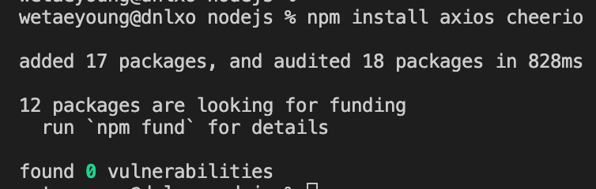
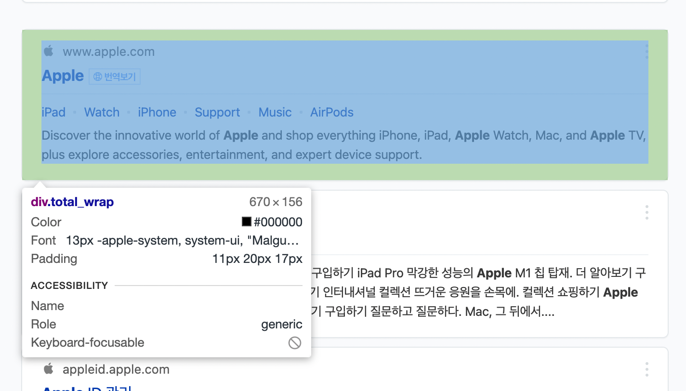
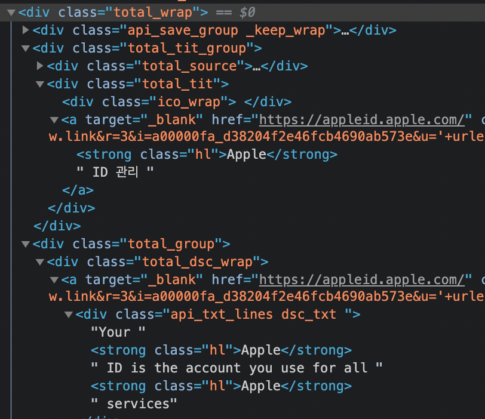
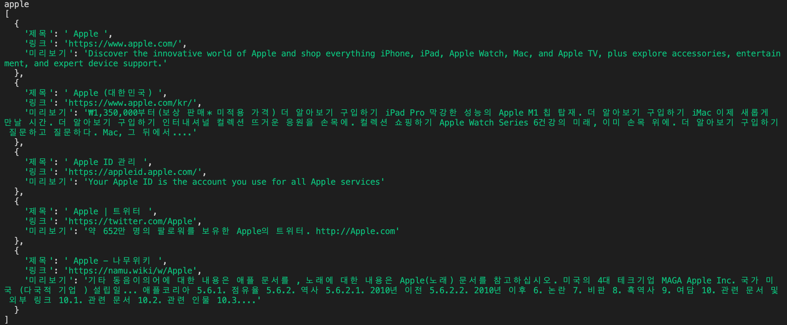
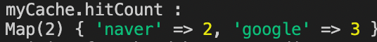
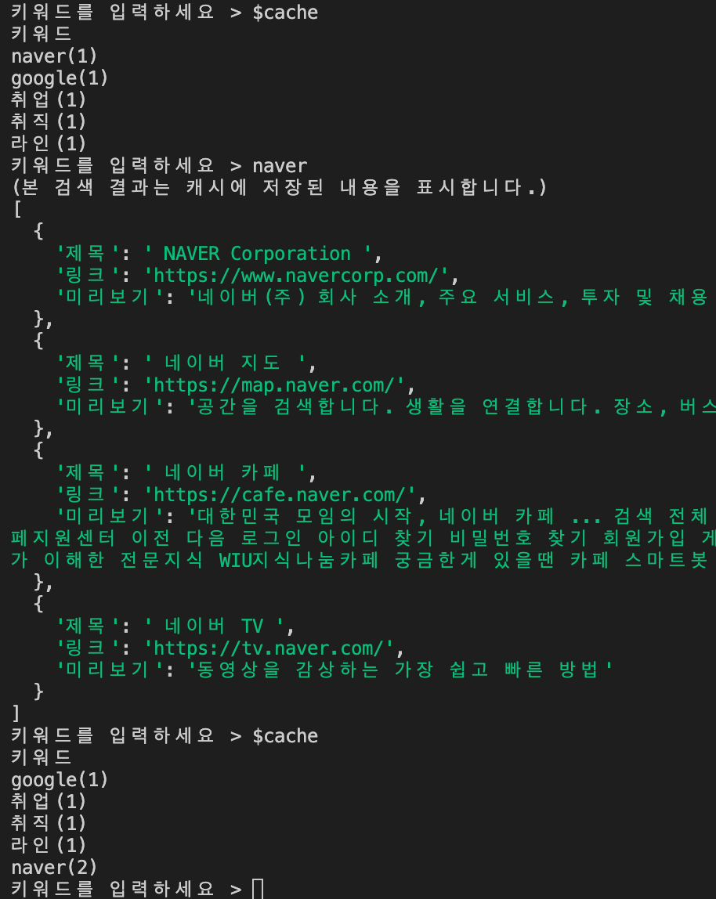
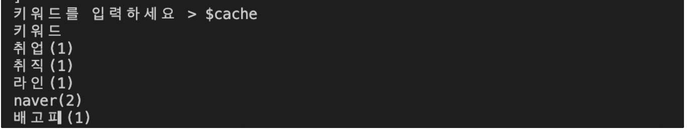
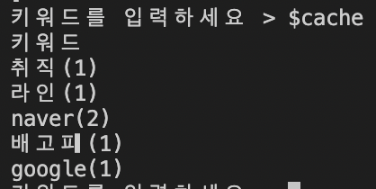

# JS로 웹 크롤링 해보기

---

## npm 설치 및 설정

- npm 버전을 확인해주고 최신 버전으로 업데이트 하였다!


- npm init -y 로 package.json 파일을 만든다!
- axios 와 cheerio 설치하기



---

## HTML 전체를 가져와보자

- axios와 cheerio를 선언한다.
- axios로 http 통신을 통해 html을 받아올 수 있고
- cheerio는 파싱을 제이쿼리를 사용하듯이 쉽게 가능하도록 해준다.

```js
const axios = require("axios");
const cheerio = require("cheerio");
```

- axios.get() 을 통해 html 전부를 받아온다.

```js
const getHTML = async(keyword) => {
    try {
        return await axios.get("https://search.naver.com/search.naver?where=nexearch&sm=top_hty&fbm=0&ie=utf8&query=" + encodeURI(keyword));
    }catch(err) {
        console.log(err);
    }
}
```

---

## 파싱을 해보자

```js
const parsing = async (keyword) => {
    const html = await getHTML(keyword);
    const $ = cheerio.load(html.data);
const $searchList = $(".total_wrap");

    let searches = [];
    $searchList.each((idx, node) => {
        searches.push({
            제목 : $(node).find(".total_tit > a").text(),
            링크 : $(node).find(".total_tit > a").attr("href"),
            미리보기 : $(node).find(".dsc_txt").text()
        });
    });
    console.log(searches);
}

parsing("apple");
```

- 제목, 링크, 미리보기는 네이버 검색창에서 개발자 도구를 켠 뒤 태그를 찾아본다.



- 각 "total_wrap" 마다 우리가 크롤링 해올 제목, 링크, 미리보기가 담겨있다.



- 소스를 살펴보면 제목, 링크, 미리보기가 담긴 태그들을 확인할 수 있다!!



---

## import와 export

- package.json 파일에서 "type": "module" 을 추가해주고
- “type” 필드 값을 “module”로 설정한 후엔 모듈 처리 방식이 import를 사용하는 es6 방식으로 변경되었기 때문에 설정을 위와 같이 바꾼 후에는 
- **require로 불러오던 모듈들을 import로 불러오도록 변경해야 한다.**

```js
const cheerio = require("cheerio");
// 아래와 같이 바꿔준다.
import cheerio from "cheerio";
```

---

## 입력 모듈 구현하기

- 여러 번 계속 입력 받다가 엔터를 입력하면 종료되도록 만들었다.
- 캐시와 검색모듈을 불러왔다.

```js
import { axios, cheerio, getHTML, parsing } from "./naver.js"
import { deleteCache, solution, addData, nowCache, myCache, LRU } from "./cache.js"
import readline from "readline";
export { rl, readline }

const rl = readline.createInterface({
    input: process.stdin,
    output: process.stdout
});

rl.setPrompt("키워드를 입력하세요 > ")
rl.prompt()
rl.on("line", (line) => {
    if (line == "") {
        rl.close()
    } else if (line == "$cache") {
        nowCache(myCache)
        rl.prompt()
    } else {
        solution(line, myCache);
    }
});
```

---

## 캐시 구현하기

### 1. LRU 캐시 클래스 만들기

```js
class LRU {
    constructor(keyword_capacity, data_capacity) {
        this.keyword_capacity = keyword_capacity;
        this.data_capacity = data_capacity;
    }
    hitCount = new Map(); // 키워드 별로 hitCount가 맵 객체로 들어간다
    cache = new Map(); // 키워드 별로 파싱된 데이터들이 들어간다.
}

let myCache = new LRU(5, 10);
```

- 즉 myCache는 맵 객체를 두 종류 가지고 있다.



- myCache.cache 는 { 'naver' => [파싱한 데이터들] } 요런 식이다.

### 2. 로직 구현

```js
function solution(keyword, myCache) { // 키워드를 받은 뒤 캐시에 넣기 전 이미 있는지 확인한다.
    if (myCache.hitCount.has(keyword)) { // 1. 이미 있으면 hitCount 증가시키고 제일 최근 검색에 한 것으로 업데이트한다.
        const temp = myCache.hitCount.get(keyword)
        myCache.hitCount.delete(keyword) 
        myCache.hitCount.set(keyword, temp + 1) // 삭제 후 젤 끝으로 다시 넣어서 업데이트
        console.log('(본 검색 결과는 캐시에 저장된 내용을 표시합니다.)')
        console.log(myCache.cache.get(keyword)) // 캐시에 저장된 데이터를 내놓는다.
        rl.prompt()
    } else { // 2. 캐시에 없는 키워드면
        if (myCache.keyword_capacity == myCache.cache.size) { // 2-1. 캐시가 꽉 차있을 경우
            deleteCache(myCache) // 가장 오래전에 검색한 것을 hitCount 와 cache에서 지운다.
        }
        addData(myCache, keyword) // hitCount를 증가시키고, 캐시에 데이터를 추가하고 데이터를 내놓는다.
    }
}
```

- 해당 키워드가 캐시에 존재하는가 ?
- 캐시가 꽉 차있는가 ?
- 두 가지를 중심으로 먼저 설계하고, 나머지는 하위함수로 뺐다.

### 3. 하위 함수

```js
function addData(myCache, keyword) {
    myCache.hitCount.set(keyword, 1)
    parsing(keyword).then(function(result) {
        myCache.cache.set(keyword, result.slice(0, myCache.data_capacity - 1));
        console.log(myCache.cache.get(keyword));
        rl.prompt()
    })
}

function nowCache(myCache) { 
    console.log('키워드')
    myCache.hitCount.forEach((val, key, map) => {
        console.log(`${key}(${val})`);
       })
}

function deleteCache(myCache) {
    let num = 0
    for (let i of myCache.hitCount.keys()) {
        num = i
        break
    }
    myCache.hitCount.delete(num)
    myCache.cache.delete(num)
}
```

---

### 오류 검증

1. 캐시된 내용이 있을 때 또 파싱하지 않고 캐시된 데이터를 바로 출력하는가?
2. naver google naver 를 검색한 이후 계속해서 새로운 키워드를 검색했을 때 naver가 아닌 google 이 잘 지워지는가 ? (naver를 나중에 또 검색하여 google이 더 오래전에 검색한 것이 되었으므로)
3. 캐시에서 한 번 삭제된 이후 다시 검색되었을 때 count가 초기화 되어있는가?







- 세 가지 모두 잘 된 듯 하다. ㅎㅎ 로직구현이 약간 스파게티스러우니 문법공부를 해야겠다.