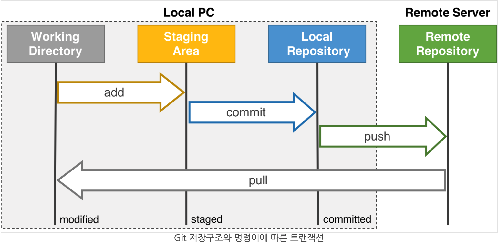

# day01 (2021/07/19)

# 🍪 TIL

---

- **⚡️ 터미널 명령어**

    ### **쉘 이란?**

    - 쉘(shell): 사용자와 컴퓨터 하드웨어 또는 운영체제간 인터페이스
    - 사용자의 명령을 해석해서, 커널에 명령을 요청해주는 역할
    - 관련된 시스템콜을 사용해서 프로그래밍이 작성되어 있다.

    ### 기본적인 명령어

    - cd (주소) : 디렉토리를 이동할 수 있다. 주소를 직접 적지 않고도, cd 를 쓰고 Tab을 누르면 이동할 수 있는 디렉토리들이 뜬다!
    - cd - : 이전 디렉토리로 이동한다.
    - pwd : 현재 작업중인 디렉토리 주소가 뜬다.
    - ls : 현재 디렉토리의 파일과 디렉토리들이 뜬다!
    - ls -al : 숨김파일과 폴더까지 뜬다!
    - mv (파일명) (이동시킬 주소): 현재 디렉토리에 있는 파일을 다른 곳으로 이동시킨다!\
    - mv 를 이용하여 파일이나 디렉토리 이름을 변경할 수 있다! : mv (기존 이름) (변경할 이름)
    - mkdir (디렉토리명) (디렉토리명2) : 현재 디렉토리에 새로운 디렉토리를 만든다. 여러개도 한 번에 가능하다!
    - rm (파일명) : 해당 파일을 삭제한다.
    - rm * : 모든 파일을 삭제한다.
    - rm *.py : .py로 끝나는 모든 파일을 삭제한다
    - rm -r (디렉토리명) : 디렉토리를 삭제한다.
    - rm -rf (디렉토리명) : 디렉토리를 강제로 삭제한다. (소문으로만 듣던 공포의 rm -rf 가 이거였군)
    - cp (복사할 파일명) (새로운 파일명) : 원본 파일을 새로운 파일명으로 복사한다.
    - cp (복사할 파일명) (주소) : 해당 주소에 동일한 파일명으로 복사를 한다!
    - cp -r (복사할 디렉토리) (주소) : 해당 주소에 디렉토리를 통째로 복사한다.

---

- **⚡️ Git**
    - 버전 관리를 위해 사용한다.
    - git은 모든 파일의 변화를 기록한다..!
    - 매 버전을 압축파일로 통째로 백업하는 방식은 용량을 많이 차지한다..
    - git init : 이 폴더의 모든 수정내역들이 저장되는 공간이 생긴다.
    - 특정 백업 시점이 되면 git add, git commit 명령어로 현재 폴더의 내용들을 박제한다!
    - commit message는 작업수행 내용을 적으면 된다.
    - 폴더 전체가 따로 복사되는게 아니라 각 버전의 변경사항들만 기록된다.
    - 버전을 되돌리고 싶을 때는 git logs 명령어로 확인 후 git reset —hard 명령어로 과거상태로 복원시킨다.
    - 수정 내역은 복원되고, 새로 만들었던 파일은 삭제되고, 지웠던 파일은 복구가 된다.
    - 협업 시에 큰 도움이 된다.
    - 프로젝트에 여러 시도를 할 수 있도록 가지치기가 가능하다 ! (branch)
    - main branch에서 주 작업을 하고, 다른 branch에서 여러 작업을 하다가 해당 branch의 작업이 완성되고 오류가 없음을 검증 받으면 main branch에 병합시킨다! (git merge)
    - 문제가 생길 경우 누가 해당 코드를 건드렸는지 확인할 수 있고, 과거로 돌아가 문제를 해결할 수 있다.
    - github은 git으로 관리하는 프로젝트, 코드를 저장할 수 있는 서비스다.

    ### 깃을 통해 변경내역이 저장되는 과정

    

    - **Working Directory :** 현재 작업 중인 파일들이 있는 내 PC의 디렉토리. 자유롭게 프로젝트를 작업할 수 있다.
    - **Staging Area :** 커밋하기 전 대기 장소. git add 명령어를 사용하여 Working Directory의 변경내역을 Staging Area에 올린다.
    - **Local Repository :** 커밋들이 스냅샷으로 기록된 곳입니다. git commit 명령어를 사용하면 Staging Area에 있는 변경내역들을 실제 스냅샷으로 묶어 Local Repository에 올릴 수 있다.

    > **하나의 commit이 하나의 버전의 구분점이 되며, 이전 버전에서 해당 버전으로의 변경내역이 담겨 있다.**

    - **Remote Repository :** 로컬 PC를 넘어 원격 서버에서 관리되는 저장소입니다. 이 곳에 올라온 커밋은 이제 다른 사람들도 참조 할 수 있다. 커밋 단위로 해당 버전의 프로젝트를 내려받는 등의 행위가 가능. 외부 저장소이기 때문에 로컬 환경의 파일이 손상되더라도 외부 저장소에 올라간 기록은 따로 유지됩니다.
    - 커밋까지의 작업은 모두 내 **로컬 환경**에서 일어난다. 만약 포맷이나 폴더삭제 등을 통해 내 PC에 있던 git 디렉토리가 사라진다면 버전 정보 역시 잃어버리는 것. 이러한 점은 파일의 사본을 백업본으로 유지하는 앞선 상황과 같다. 또한 다른 사람들이 내 프로젝트를 볼 수도 없다. 이런 위험을 방지하고 다른 환경에서도 참조하기 위해서는 로컬에 있는 커밋들을 **원격 서버**에 올려야 한다. Local Repository에 있는 커밋을 리모트 서버에 올리는 명령어가 바로 ‘git push’ 이다.
    - 우아한 형제들 안드로이드 파트에서는 Github-flow가 아닌 Git-flow를 이용한다.

        [https://techblog.woowahan.com/2553/](https://techblog.woowahan.com/2553/)

    - **깃의 브랜칭과 배포에 대한 전략은 회사의 상황에 따라 달라진다고 한다.**
    - 넘 어렵다..

---

- **⚡️ Node.js**
    - Node.js는 자바스크립트를 웹 브라우저 밖에서도 사용할 수 있게 해주는 또 다른 자바스크립트 실행 환경이다.
    - 덕분에 자바스크립트를 사용하여 서버 프로그래밍이 가능하다!
    - **LTS 버전 :** Long Term Support 버전. 2년간 해당 버전에 대한 취약점 패치, 개선사항에 대한 패치를 보증하는 버전이다.
    - **Current 버전** : 개발이 진행중인 버전. 해당 버전에 존재하는 기능이 패치를 통해 사라지거나 변경되어 새로 코드를 작성해야할 가능성이 존재하는 버전이다.
    - Current 버전을 사용할 경우 추후에 코드가 동작하지 않을 수도 있으므로 LTS 버전을 사용하는 것이 안정적이다.
    - JSON.stringify() : 문자열로 바꾸기

    ### sort(비교함수) :

    ```jsx
    // 숫자형 오름차순 정렬하기
     
    sort(function(a, b)) { 
    		return a - b; 
    }
    
    // compareFunction(a, b)이 0보다 작은 경우 a를 b보다 낮은 색인으로 정렬합니다. 즉, a가 먼저옵니다.
    ```

---

# ✏️ 끄적끄적..

---

- **프로그래밍을 할 때..**
    - 코드 작성 전에 구조 설계에 오랜 고민을 한다.
    - 검색을 생활화한다.
    - 검색으로 해결 불가능한 경우 주변인에게 도움을 요청한다.
    - 함께 고민하는 것은 성장에 큰 도움이 된다.
    - 서로 사용한 용어에 차이점이 있는지를 생각해본다.
    - 아이디어, 접근 방법, 구조 설계에 대해 생각해본다.
    - google, mdn, stackoverflow 활용하기!
    - 영어로 검색해보기! 익숙해지자..
    - 함수는 하나의 역할에 집중해야 한다.
    - 일관성을 고집하자.
    - 하위 함수를 잘 나누자
    - 고차함수를 활용하자
    - 디버깅을 잘 활용하자

- **느낀 점**

    정리를 어떻게 할지 위주로 생각하다보니, 개인 학습이 잘 되지 않은 것 같다... 

    시간을 효율적으로 사용하지 못하고 있는 것 같다...

    그래도 복습과 예습 열심히 해보자!

---

- 출처

    [https://www.youtube.com/watch?v=Bd35Ze7-dIw](https://www.youtube.com/watch?v=Bd35Ze7-dIw)

    [https://iwantadmin.tistory.com/257](https://iwantadmin.tistory.com/257)

    [https://developer.mozilla.org/ko/docs/Web/JavaScript/Reference/Global_Objects/Array/sort](https://developer.mozilla.org/ko/docs/Web/JavaScript/Reference/Global_Objects/Array/sort)

    [https://www.secmem.org/blog/2019/04/10/git_pr/](https://www.secmem.org/blog/2019/04/10/git_pr/)

    [https://hellowoori.tistory.com/56](https://hellowoori.tistory.com/56)