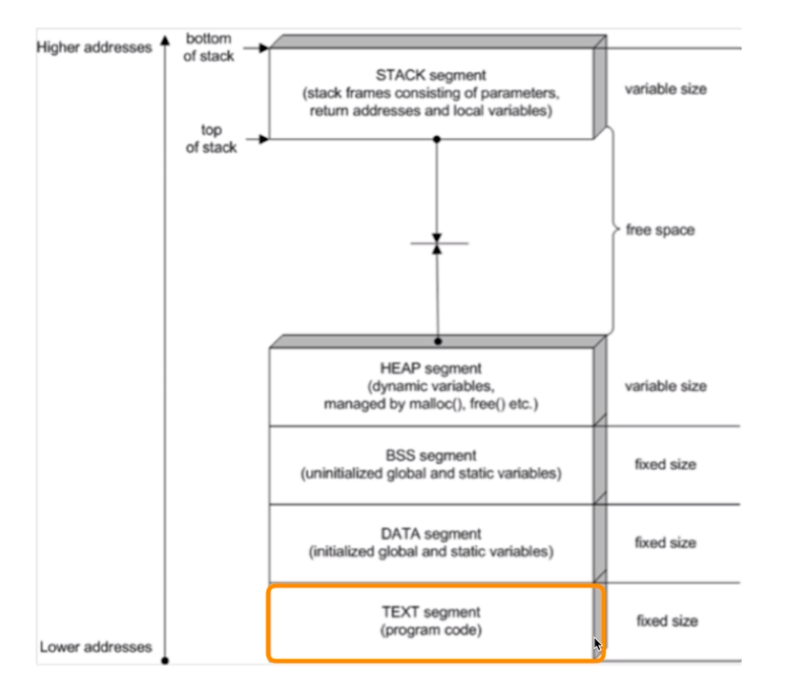

## 프로세스의 구조

스케쥴러가 프로세스를 바꿔주는 메커니즘 : 컨텍스트 스위칭

- 프로세스의 구성
  - text(CODE) : 코드
  - data : 변수/초기화 된 데이터
  - stack : 임시 데이터(함수 호출, 로컬변수 등)
  - heap : 코드에서 동적으로 만들어지는 데이터
- PC(Program Counter) + SP(Stack Pointer)

PC와 SP는 운영체제가 관리하는 PCB(Process Control Block)에 저장!

1. CPU의 현재 PC와 SP값을 PCB에 저장
2. 바꿀 프로세스의 저장된 PC와 SP값을 CPU 레지스터에 넣어주고
3. 실행

- PCB에는
  - Process ID
  - Register 값
  - Scheduling Info (Process State)
  - Memory Info (메모리 사이즈 limit) 등을 저장

## 컨텍스트 스위칭

+ Context Switching (문맥 교환)
  - CPU에 실행할 프로세스를 교체하는 기술

1. 실행 중지할 프로세스 정보를 해당 프로세스의 PCB에 업데이트해서, 메인 메모리에 저장
2. 다음 실행할 프로세스 정보를 메인 메모리에 있는 해당 PCB 정보를 CPU에 넣고 실행

디스패치 (dispatch) : ready 상태의 프로세스를 running 상태로 바꾸는 것

컨텍스트 스위칭은 빈번하게 일어나기 때문에, 시간을 짧게 해야한다.

시간을 조금이라도 줄이기 위해서 컨텍스트 스위칭 코드는 어셈블리어로 작성되어있는 경우가 있다.

### 컴파일러?

- 컴파일러가 등장하면서 서로 다른 CPU 아키텍처에 맞게 다시 프로그램 코드를 작성할 필요 없이, 컴파일러 프로그램만 만들면 된다.
- 그러나 어셈블리어로 작성한 코드보다는 속도가 떨어질 수 있다.

- 리눅스의 경우 컨텍스트 스위칭 코드는 각 CPU마다 별도로 존재한다.

