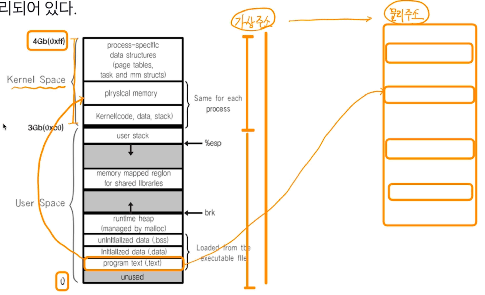
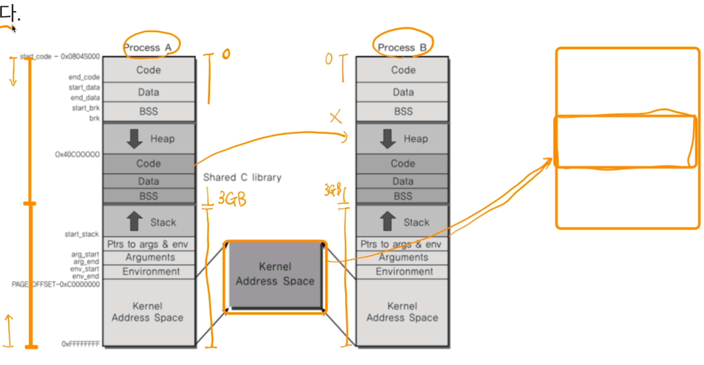
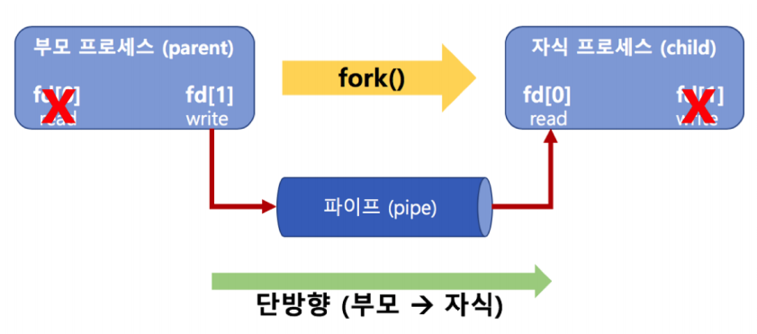
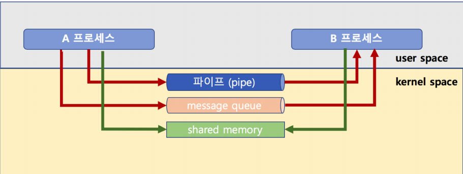
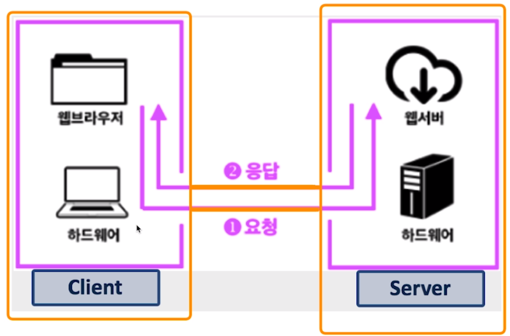

## 프로세스간 커뮤니케이션

프로세스간에는 커뮤니케이션을 필요로 하지만 직접적인 방법은 없다.

#### 따라서 IPC(InterProcess Communication) 기법을 이용한다.

프로세스는 다른 프로세스의 공간을 접근할 수 없도록 되어있다.

왜? 프로세스의 데이터/코드가 바뀔 수 있으니 위험!

- 프로세스간 통신이 필요한가?
  - 성능을 높이기 위해 여러 프로세스를 만들어서 동시 실행
  - 이 때 프로세스간 상태 확인 및 데이터 송수신이 필요

#### 예) fork() 시스템콜

- fork() 함수로 프로세스 자신을 복사해서 새로운 프로세스로 만들 수 있음
- 여러 프로세스를 동시에 실행 가능.
- 1~10000 더하기를 fork() 함수로 10개의 프로세스 만들어서, 각각 더하고
- 각 프로세스가 더한 값을 합하면 (프로세스간 통신 필요) 더 빠르게 동작 가능

#### 예) 웹서버

- 웹서버란? 요청이 오면, HTML 파일을 클라이언트에 제공하는 프로그램

- 새로운 사용자 요청이 올 때마다 fork() 함수로 새로운 프로세스 만들고, 각 사용자 요청에 즉시 대응

  > 따라서 CPU 병렬 처리가 가능하다면, 더 빠른 대응이 가능하며,
  >
  > 이 때 각 프로세스 제어 및 상태 정보 교환을 위해 프로세스간 통신이 필요하다.

### 파일을 사용한  커뮤니케이션

- IPC 기법 중 하나로, 다른 프로세스에 전달할 내용을 file에 쓰고, 다른 프로세스가 해당 file을 읽으면 됨 (저장매체는 프로세스가 공유 가능하기 때문)
- 하지만 file을 사용하면, 실시간으로 직접 원하는 프로세스에 데이터 전달이 어려움
  - why? (프로세스가 실시간으로 계속 파일을 읽고만 있을 수는 없다..)
- 또 저장매체를 들렀다 와야하기 때문에 시간이 오래걸린다.
- 더 다양한 기법들이 있다.

### 프로세스간 공간은 완전히 분리되어 있다.

- 하지만 프로세스간에 커널 공간은 공유한다.

## 정리

- 여러 프로세스 동시 실행을 통한 성능개선, 복잡한 프로그램을 위해 프로세스간 통신이 필요하다.
- 프로세스간 공간이 완전히 분리되어 있다,
- 프로세스간 통신을 위한 특별한 기법이 필요하다. (IPC)
- 대부분의 IPC 기법은 결국 커널 공간을 활용하는 것이다.

## 다양한 IPC 기법

- pipe (파이프)
  - 기본 파이프는 단방향 통신
  - fork()로 자식 프로세스를 만들었을 때, 부모와 자식간의 통신

- 메시지 큐 (message queue)
  - FIFO 정책으로 데이터를 전송
  - 키값을 이용하여 양방향 통신이 가능

- 파이프와 메시지 큐
  - 메시지 큐는 부모/자식간이 아니라, 어느 프로세스간에라도 데이터 송수신이 가능
  - FIFO
  - 파이프는 단방향, 메시지는 양방향 가능

- 공유 메모리 (shared memory)
  - 노골적으로 kernel space에 메모리 공간을 만들고, 해당 공간을 변수처럼 쓰는 방식
  - message queue처럼 FIFO 방식이 아니고, 해당 메모리 주소를 마치 변수처럼 접근하는 방식
  - 공유메모리 key를 가지고, 여러 프로세스가 접근 가능

> 모두 커널 공간을 활용하여 프로세스간 데이터 공유를 한다.
>
> (참고) 메모리 공간도 kernel/user 로 구분된다.

### IPC 기법이지만, 이외에도 많이 사용되는 기술 두가지

#### 시그널 (signal) - (이벤트이다..)

- 유닉스에서 30년 이상 사용된 전통적인 기법
- 커널 또는 프로세스에서 다른 프로세스에 어떤 이벤트가 발생되었는지를 알려주는 기법
- 프로세스 관련 코드에 관련 시그널 핸들러를 등록해서, 해당 시그널 처리 실행
  1. 시그널 무시
  2. 시그널 블록 (블록을 푸는 순간, 프로세스에 해당 시그널 전달)
  3. 등록된 시그널 핸들러로 특정 동작 수행
  4. 등록된 시그널 핸들러가 없다면, 커널에서 기본 동작 수행

주요 시그널 (기본 동작)

- SIGKILL : 프로세스를 죽여라
- SIGALARM : 알람을 실행
- SIGSEGV : 프로세스가 다른 메모리영역을 침범했다.
- 등등........

 PCB에 해당 프로세스가 블록 또는 처리해야하는 시그널 관련 정보 관리

커널모드에서 사용자모드로 전환시 해당 프로세스의 PCB signal 확인 후, 처리가 필요하다면 해당 커널 함수 실행 후 user 모드로 올라간다. 

#### 소켓 (socket)

- 소켓은 네트워크 통신을 위한 기술
- 기본적으로는 클라이언트와 서버 등 두개의 다른 컴퓨터간의 네트워크 기반 통신을 위한 기술

