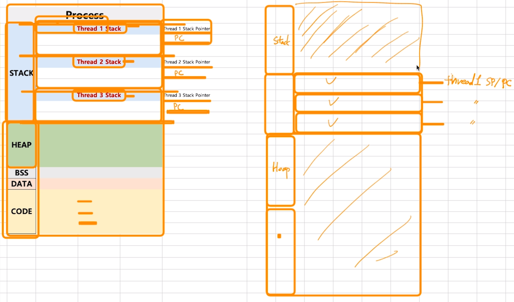
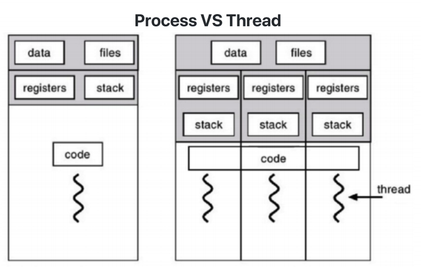
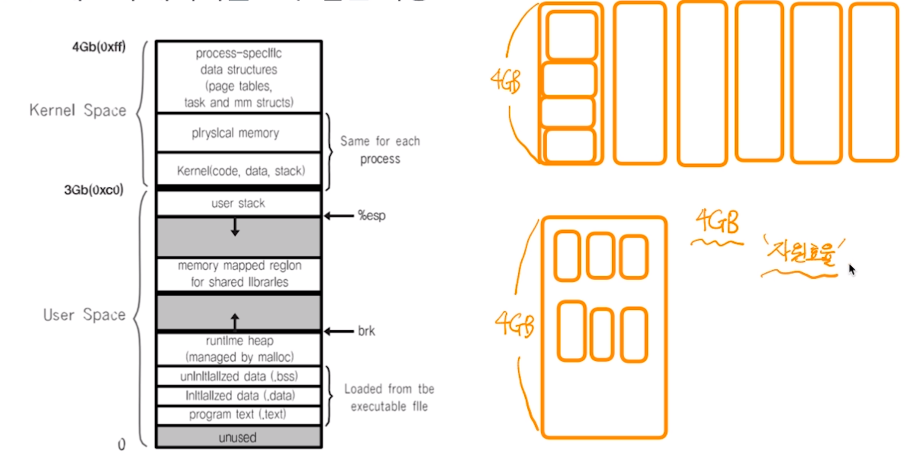
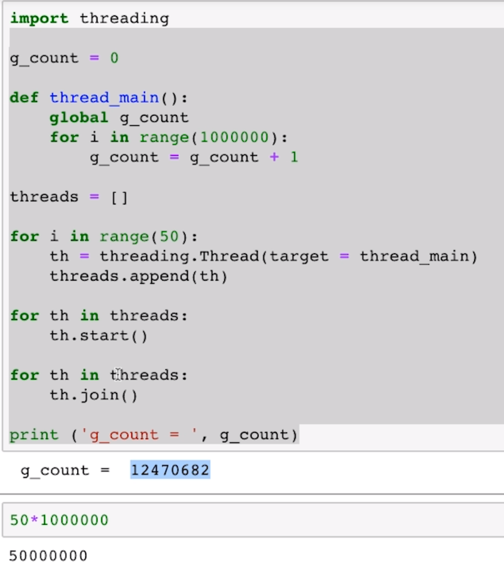
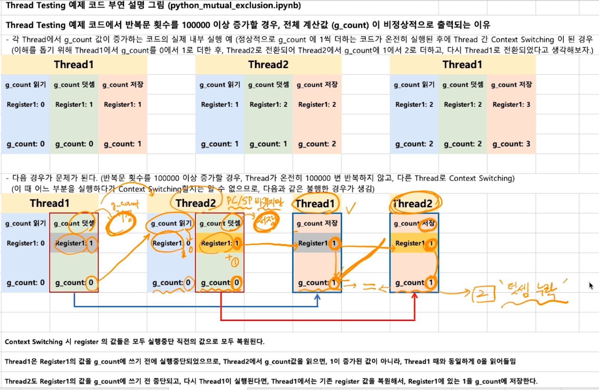

## Thread (스레드)


- Light Weight Process 라고도 한다.
- 프로세스처럼 동작하지만 구조가 작다
- 프로세스 : 프로세스 간 각 프로세스 데이터 접근이 불가하여 IPC 사용해야함
- 스레드 ?
  - 하나의 프로세스에 여러개의 스레드 생성 가능
  - 스레드들은 동시에 실행 가능
  - 프로세스 안에 있으므로, 프로세스의 데이터를 모두 접근 가능 (IPC 필요x)


Thread는 각기 실행이 가능한 stack이 존재한다.

각 Thread 를 위한 SP와 PC가 생성 됨

스택과 힙 공간 사이에 스레드 스택을 위한 공간을 만들고.

나머지 HEAP BSS DATA CODE 영역은 공유한다.





소프트웨어 병행 작업 처리를 위해 Multi Thread를 사용한다.

## 멀티 프로세싱과 Thread

멀티 태스킹 : 단일 CPU가 여러 프로세스를 실행시키는 것

멀티 프로세싱 : 하나의(여러개의) job을 여러 cpu를 병렬실행으로 실행속도를 높이는 것 (여러 CPU 여러 프로세스)

하나의 job을 여러개로 분할하여 여러 cpu에 처리를 맡김(Thread : IPC 기법 필요x, foik() : IPC 기법 필요함)

최근 CPU는 멀티 코어를 가지므로, Thread를 여러개 만들어서 멀티코어 활용도를 높임

## Thread 의 장점

1. 사용자에 대한 응답성 향상

예) 서버에서 여러 클라이언트에게 웹페이지를 더 빨리 보여준다.


2. 자원 공유 효율
   - IPC 기법과 같이 프로세스간 자원공유를 위해 번거로운 작업이 필요 없다
   - 쓰레드는 프로세스 안에 있으므로, 프로세스의 데이터를 모두 접근 가능



3. 작업이 분리되어 코드가 간결
   - 이것은 작성하기 나름이다

## Thread의 단점

- 스레드 중 한 스레드만 문제가 있어도, 전체 프로세스가 영향을 받는다.


- 스레드를 많이 생성하면 Context Switching이 많이 일어나 성능 저하된다.
- 예) 리눅스에서는 Thread를 별도의 Process와 같이 다룬다 (스케쥴링을 한다)
  - 스레드를 많이 생성하면, 모든 스레드를 스케쥴링 해야 하므로 컨텍스트 스위칭이 빈번할 수 밖에 없다.

## Thread vs Process

- 프로세스는 독립적, 스레드는 프로세스의 서브셋 
- 프로세스는 각각 독립적인 자원을 가짐, 스레드는 프로세스 자원 공유 
- 프로세스는 자신만의 주소영역을 가짐, 스레드는 주소영역 공유 
- 프로세스간에는 IPC 기법으로 통신해야 함, 스레드는 필요 없음

### 쓰레드는 어떻게 만드나

- PThread 사용
  - POSIX 스레드(POSIX Threads, 약어: PThread) 
    - Thread 관련 표준 API

## 정리 

- Thread 개념 정리 
  - 프로세스와 달리 스레드간 자원 공유
- 스레드 장점 
  - CPU 활용도를 높이고, 성능 개선 가능 
  - 응답성 향상 
  - 자원 공유 효율 (IPC를 안써도 됨) 
- 스레드 단점 
  - 하나의 스레드 문제가, 프로세스 전반에 영향을 미침 
  - 여러 스레드 생성시 성능 저하 가능

---

## Thread (스레드) ‑ 동기화(Synchronization)

### 동기화(Synchronization) 이슈 

- 동기화: 작업들 사이에 실행 시기를 맞추는 것 
- 여러 스레드가 동일한 자원(데이터) 접근시 동기화 이슈 발생 
  - 동일 자원을 여러 스레드가 동시 수정시, 각 스레드 결과에 영향을 줌

스레드의 실행 순서는 정해져 있지 않고, 스케쥴러에 의해 그때마다 실행순서가 정해지는 것이므로, 비정상 동작을 하는 경우가 있다.


1씩 더해서 10만을 만드는 프로세스 스레드 50개 생성 후 실행



비정상 동작 why? 하나의 쓰레드가 끝나기 전 컨텍스트 스위칭 되는 경우



## 동기화 이슈 해결 방안 

- Mutual exclusion (상호 배제) 
- 쓰레드는 프로세스 모든 데이터를 접근할 수 있으므로, 
  - 여러 스레드가 변경하는 공유 변수에 대해 Exclusive Access 필요 
  - 어느 한 스레드가 공유 변수를 갱신하는 동안 다른 스레그가 동시 접근하지 못하도록 막아라


### Mutual exclusion (상호 배제) 

- 임계 자원(critical resource) 
- 임계 영역(critical section) 

```python
lock.acquire() 
for i in range(100000): 
    g_count += 1 
lock.release()
```

## 동기화와 세마포어

### Mutex와 세마포어 (Semaphore)

- Critical Section(임계 구역)에 대한 접근을 막기 위해 LOCKING 메커니즘이 필요 

  - Mutex(binary semaphore)

     : 임계구역에 하나의 스레드만 들어갈 수 있음

  - Semaphore 

    : 임계구역에 여러 스레드가 들어갈 수 있음 

    : counter를 두어서 동시에 리소스에 접근 할 수 있는 허용 가능한 스레드 수를 제어

## 세마포어 (Semaphore) 

- P: 검사 (임계영역에 들어갈 때) 
  * S값이 1 이상이면, 임계 영역 진입 후, S값 1 차감 (S값이 0이면 대기) 
- V: 증가 (임계영역에서 나올 때) 
  * S값을 1 더하고, 임계 영역을 나옴 
- S: 세마포어 값 (**초기 값만큼 여러 프로세스가 동시 임계 영역 접근 가능**)


### 세마포어 (Semaphore) ‑ 바쁜 대기 

- wait() 은 S가 0이라면, 임계영역에 들어가기 위해, 반복문 수행  (loop 문 계속 돌리니 CPU자원 계속 사용)
  - 바쁜 대기, busy waiting 이라고 함...

> 프로그래밍은 근본적으로는 중단이 없음. 끊임없이 코드 실행 중단은 대부분 loop로 표현 loop는 CPU에 부하를 걸리게 함

### 세마포어 (Semaphore) ‑ 대기큐 

- 운영체제 기술로 보완 ‑ 대기큐 
- S가 음수일 경우, 바쁜 대기 대신, 대기큐에 넣는다

``` cpp
wait(S) {
		S->count--;
	if (S->count <= 0) {
		add this process to S->queue;
		block()
	}
}
```

- wakeup() 함수를 통해 대기큐에 있는 프로세스 재실행

```cpp
signal(S) { 
    	S->count++; 
    if (S->count > 0) { 
        remove a process P from S->queue; 
        wakeup(P) 
    } 
}
```

### 참고: 주요 세마포어 함수 (POSIX 세마포어) 

- sem_open(): 세마포어를 생성 
- sem_wait(): 임계영역 접근 전, 세마포어를 잠그고, 세마포어가 잠겨있다면, 풀릴 때까지 대기 
- sem_post(): 공유자원에 대한 접근이 끝났을 때 세마포어 잠금을 해제한다

## 교착상태(Deadlock)와 기아상태(Starvation)


### 참고: 교착상태 발생 조건 다음 네 가지 조건이 모두 성립될 때, 교착상태 발생 가능성이 있음 

1. 상호배제(Mutual exclusion): 

   프로세스들이 필요로 하는 자원에 대해 배타적인 통제권을 요구한다.

2.  점유대기(Hold and wait): 

   프로세스가 할당된 자원을 가진 상태에서 다른 자원을 기다린다. 

3. 비선점(No preemption): 

   프로세스가 어떤 자원의 사용을 끝낼 때까지 그 자원을 뺏을 수 없다. 

4. 순환대기(Circular wait): 

   각 프로세스는 순환적으로 다음 프로세스가 요구하는 자원을 가지고 있다.

> **교착상태 예방(deadlock prevention)** 
>
> 4가지 조건 중 하나를 제거하는 방법 
>
> 1. 상호배제 조건의 제거: 임계 영역 제거
> 2. 점유와 대기 조건의 제거: 한번에 모든 필요 자원 점유 및 해제
> 3. 비선점 조건 제거: 선점 가능 기법을 만들어줌 
> 4. 순환 대기 조건 제거: 자원 유형에 따라 순서를 매김
>
> **교착상태 회피(deadlock avoidance)** 
>
> - 교착상태 조건 1, 2, 3은 놔두고, 4번만 제거 
>   - 1, 2, 3 제거시, 프로세스 실행 비효율성이 증대 
> - 교착상태 조건 중, 자원 할당 순서를 정의하지 않음(순환 대기 조건 제거) 
>
> 1. 상호배제 조건의 제거: 임계 영역 제거 
> 2. 점유와 대기 조건의 제거: 한번에 모든 필요 자원 점유 및 해제 
> 3. 비선점 조건 제거: 선점 가능 기법을 만들어줌 
> 4. 순환 대기 조건 제거: 자원 유형에 따라 순서를 매김 
>
> **교착상태 발견(deadlock detection)과 회복** 
>
> - 교착상태 발견(deadlock detection) 
>   - 교착상태가 발생했는지 점검하여 교착 상태에 있는 프로세스와 자원을 발견하는 것 
> - 교착상태 회복(deadlock recovery) 
>   - 교착 상태를 일으킨 프로세스를 종료하거나 교착상태의 프로세스에 할당된 자원을 선점하여 프로세 스나 자원을 회복하는 것

## 기아상태(starvation) 

- 특정 프로세스의 우선순위가 낮아서 원하는 자원을 계속 할당 받지 못하는 상태 
- 교착상태와 기아상태 
  - 교착상태는 여러 프로세스가 동일 자원 점유를 요청할 때 발생 
  - 기아상태는 여러 프로세스가 부족한 자원을 점유하기 위해 경쟁할 때, 특정 프로세스는 영원히 자원 할당이 안되는 경우를 주로 의미함


### 기아상태 해결 방안 

- 우선순위 변경 
  - 프로세스 우선순위를 수시로 변경해서, 각 프로세스가 높은 우선순위를 가질 기회주기 
  - 오래 기다린 프로세스의 우선순위를 높여주기 
  - 우선순위가 아닌, 요청 순서대로 처리하는 FIFO 기반 요청큐 사용