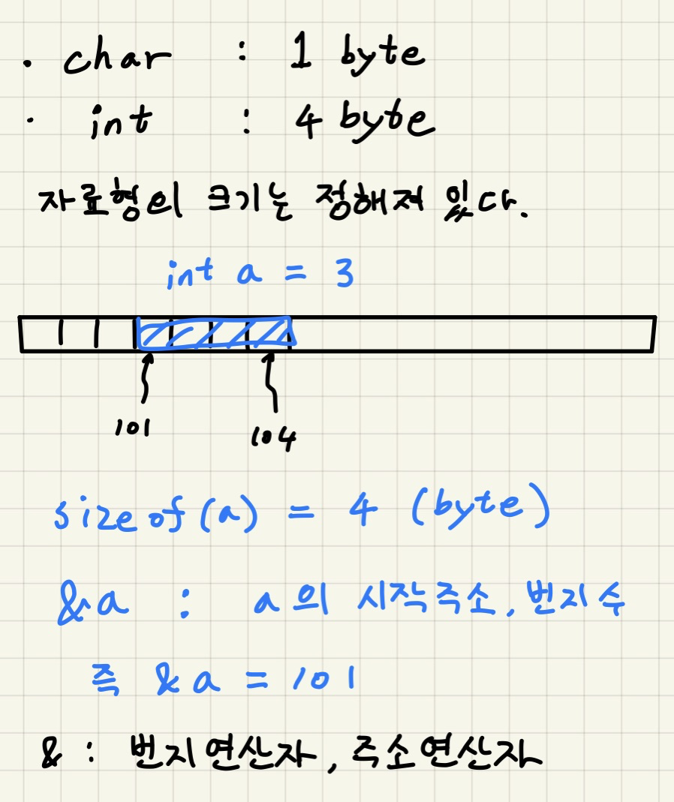
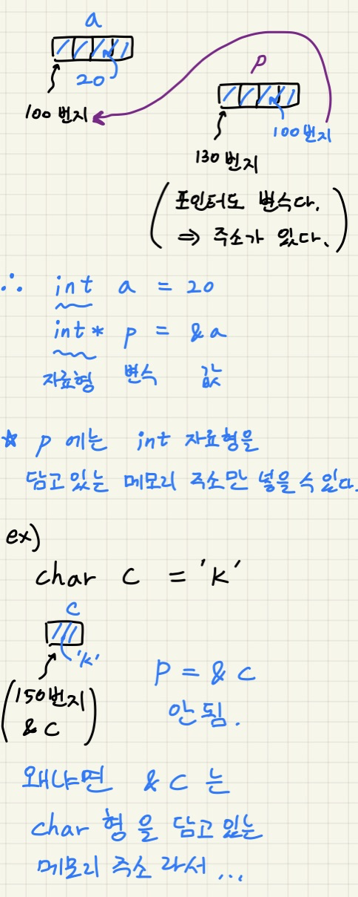

## 포인터, 프로세스 메모리 구조

- CPU와 memory(RAM, 주기억장치)는 서로 통신한다.
- 프로그램이 실행될 때 보조기억장치에서 주기억장치로 올려진 후 cpu가 작업을 진행한다. 
- 즉 컴퓨터에서 어떤 내용을 처리하기 위해서는 메모리로 가져와야한다.
- 메모리를 작업테이블이라고 생각하자
- 컴퓨터는 데이터를 처리할 때 메모리를 4가지 구역으로 나눠서 작업을 한다.
  - 코드 :
    - 컴퓨터가 이해할 수 있는 언어로 번역된 코드들이 저장된다.
  - 데이터 : 
    - 전역변수, static 변수, 상수
    - 컴파일 시 생성된다.
  - 힙 :
    - 동적 할당 영역
    - 낮은 주소에서 높은 주소로
  - 스택 :
    - 지역변수, 함수의 파라미터
    - 함수 실행시 생성된다.
    - 높은 번지부터 낮은 번지로.. 차례로 쌓인다.
    - 대입연산자는 오른쪽 함수를 먼저 실행
    - 파라미터는 뒤에서부터 앞쪽으로
    - 함수가 종료되면 사용한 값들이 스택에서 pop 된다.

---

### 메모리

- 메모리의 단위는 1byte 이다.
- 메모리의 총 번지 수 : 0x0번지 ~ 0xffffffff번지 (42.9억. 즉 2의32승) (32비트 컴퓨터)
- 메모리, 주기억장치, RAM 같은 말이다.

---

## 포인터

- 포인터는 변수다.
- 포인터 변수는 메모리 번지, 메모리 주소를 저장한다.
- C언어에서는 주소도 데이터이다.
- 자신의 자료형과 같은 주소를 값으로 갖는다.

 

- 포인터의 크기는 자료형에 상관없이 4바이트이다.
- int * p; 가 의미하는 것 ?
  - p는 포인터 변수 라는 것을 의미
- *p = 50; 가 의미하는 것 ?
  - **포인터 p가 가리키는 메모리 위치**에 50을 대입해라.
- 포인터 p는 자신의 값(가리키는 주소)을 바꿀 수 있다.
- 또, 포인터 p가 현재 가리키는 메모리 위치의 값도 바꿀 수 있다.

---

### 동적할당

- 힙 영역에 동적할당을 하면, 어떤 자료형의 데이터를 할지 아직 모르기 때문에 void*자료형의 포인터를 사용한뒤 강제형변환하여 사용한다.
- free(p)를 하게되면 동적할당 해제를 한다. 포인터를 끊고 스택에서 포인터변수를 없앤다.

---

### 출처

- https://www.youtube.com/watch?v=jNwsVx4zeR4