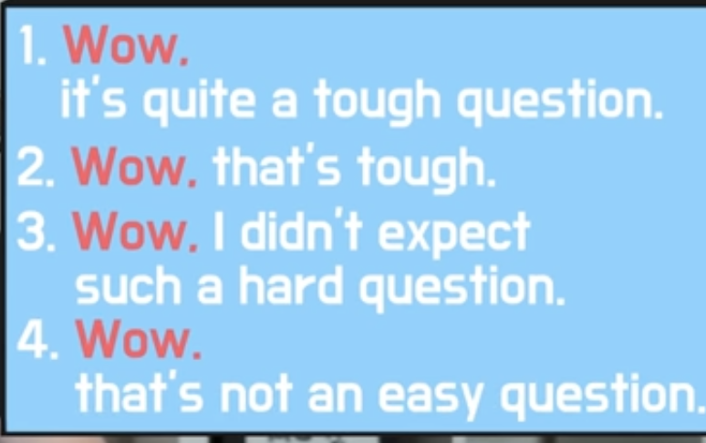

## 오픽노잼 IM시리즈 정리

1. 에바에게 질문하지 마라. 인정해라.
2. 어려운 단어 말고 쉬운 단어를 써라
3. 같은 단어 두번 쓰지마라
4. 무언가를 묘사하거나 감정단어 2개를 말할때 and 쓰지마라
5. 한 가지에 대해서만 말해라 물어본거에 대해서만!
6. 짧아도 깔끔하고 좋다. 길게 연습하기는 해라
7. 포괄적인 질문 다른거 대충대답하고 재끼고 하나에 집중한다. 나머지 1프로대답 99프로 집중대답
8. 어떤 질문이든 답변에는 4가지 카테고리가있다

> 설명 / 습관 / 과거경험 / 비교

9. 긴장이 되고 할 말이 생각안나면 바로 결론으로 가라
10. 솔직하게 말하기 거짓말 ㄴㄴ 메인포인트를 일단 앞에 말하고 핑계를 나중에말해라
11. 대답을 할 때 I think를 많이 쓰세요
12. 뭘 물어보는지 질문을 들으며 생각
13. 어떤 카테고리로 말할지 질문을 들으며 생각
14. 대중적인 사람에 대해 말한 뒤 **나에 대해서** 말한다

it's a very small place

it's just right for me

my room is comfy and cozy (x)

my room is comfy you know. i mean it's so cozy (o)

you know small house, less cleaning~

말을 마무리할때 that's all, that's it 이렇게 끝내지마셈

> 오픽 5-5 선택시 15개 문제
>
> 1번 자기소개
>
> 234번 4번어렵
>
> 567번 7번어렵
>
> 8910번 10번어렵
>
> 111213번 롤플레이세트
>
> 1415 질문어려운세트

 i'm barely home

i only come home to sleep

i can do whatever i feel like

yeah를 너무 많이 쓰지마라

that is what i **usually** do at home on weekends

it helps me to relax

it makes me feel so good to watch movies all day

빠른 비교

- i never did this before but you know nowadays i just love doing this
- i just can't explain it

예를들어 어릴적 여행기억에 대해 물어보면

캐나다에 갓다. > 근데 기억은 잘 안난다. 이런순서로 말하셈

술집에 최근에 언제갓냐?

2달전 갓다 > 그다음 말하고싶은걸 말해라 

메인내용을 먼저 말해야 상대가 이해가 빠름

핑계를 나중에 해라

- Comparison Strategy : 메인포인트 현재에 대해서만 말하기 과거에 대해 말하지마세요. just focus on present
- 설명에 대한 질문 연습 많이하기
- 과거 현재 결론 ㄴㄴ 현재 과거 결론 순서로 말해

i can't remember very specifically, but one thing i do remember is that ~ 이러한 핑계대답은 나중에말하라고

i think the coffee there was just so good.

and that's why i cant go to any other coffee shops

i felt like ~~ i feel like ~~ 많이 쓰세요

감정을 보여주는 표현을 연습해라

질문 이해 못하면 스킵하세요

뭘 물어보는지 어떤 카테고리인지 생각을 먼저하기

대답할때 내가 얘기한 main point 에 대해서만 생각하자

한가지로만 이야기

질문 이해못햇는데 답변하는거 완전 병신임

alright

부모님하고 살땐 i'm currently living with my parents

whether i like it or not i have no choice but to be with my parents

i'm not extroverted at all

i prefer to spend time alone

they always want to talk with me

but sometimes i just need to be alone 

i really wanna get outta here

i can gurentee it

i started laugh out, i felt like

but the problem was.. you know

kind of standing up 약간 서가지고.. you know

> \1. Yesterday, I watched the movie and literally it was the best movie ever. - 영쌤 is literally a good teacher. 2. You're pretty nice.  꽤, 매우 - you're so pretty. 예쁘다 - That's pretty so nice! 3. Hello how are you doing? 4. I got paid. 월급 받았다 5. Keep the change! 6. Can I have an ice Americano?/I'll have ~/I'd like to ~ 7. When you're done please let me know. 8. I'll let you know when I'm done. 9. What was that? 뭐라고? 10. Are you hearing me? 11. Where were we? 12. May or may not. 그럴수도 있지 - He will come to tonight? 13. Good for you! 14. Looks good on you. - The shoes looks good on you. - The jacket is looks good on you  15. Do you mind if I ask you a favor? - Can I ask you a favor? do you mind? 16. It was like hell. - He was like ~ - She was like a weird. 17. I'm serious. 18. It is./she is/He is. 호응 19. I'm down! 나 참석 - Who wants to drink beer tonight? 20. You're/he so mean! 너 되게 못됐다 21. What does that mean? 저의가 뭐야? - What does the world fancy mean? 22. Have fun ~! 23. Take care! 작별인사 할때 24. What am I supposed to do next? 25. Savage! 쩐다 (슬랭) 26. I'm straight as an arrow! 나는 이성애자예요. 27. Can you cover for me? 잠깐 내 일 좀 맡아줄래? 28. Can you pick me up? - I'll pick you up!

## 설명 description 카테고리

  무언가를 묘사할 때는 메인포인트가 필요하다.

제가 가장 좋아하는 차는 비엠입니다. (x)

비엠 좋아해요 (o)

i like / i really like / i love bmw

**what i really love about ~~ is ~~**

my home isnt big its not that small either,~

**But i gotta say**

it's just so spacious~

MP 말하기 전에 쪼금만 아주간단히 설명하는건 ㄱㅊ

근데 이게 잘안대면 걍 메인포인트먼저 말하셈; ㅇㅇ 이걸 추천

you see : 잘 들어바~ 이런 느낌

 But none of that really metters i guess cos i love how big storage room is

- Main Point
  1. I hate fashion in Korea. People only wear safe colors > 수정 what i really hate about fashion here in korea is that people tend to only wear safe colors
  2. It's boring. >  수정 i find it quite boring > i guess you can say i find it quite boring
  3. i try not to follow that > 수정 you see **for me** (나에대한 설명으로 돌아오기) i try not to follow those trends.
  4. i try to wear more colorful clothing > i try to be as colorful as possible
  5. i like to stand out > i guess you can say i like to stand out > 설명을 할때 you can say 라고 할수있다. i guess 랑 합치셈

**tend to**

**what i really hate about**

**here in**

**find it ~**

**quite**

**i guess, um, you know**

- Main Point
  1. what i really find intersting about My work desk is that it's the only dark furniture i have at home.
  2. it's **completely** black and **totally** stands out in my living room > stands out 눈에 띈다.
  3. all my other furniture is light in color

## 습관 Habit 카테고리

1. 습관에 대해 뭐하는지를 설명하고
2. 나한테 중요하다고 말하고
3. 프리스타일 조지고
4. 퀵 컴패리즌 과거잠깐 갓다가 현재 결론말하고 끝내기

habit 카테고리는 메인포인트가 없어도 되긴하지만. 있으면 더 깔끔하다

GENERAL MP 가 필요하다. 일반적인... 메인포인트 포괄적인... >

ex) 은행에갈때 보통 뭘하시나요? > 행동에 관한 질문 > 은행에갈때는 저는 무조건 에어팟을 가져가요

No matter what. whenever i go to the bank. 

i always make sure to bring ~

필러 well. here's the thing.

> well. here's the thing. No matter what. whenever i go to the bank. i always make sure to bring my airpods

좀 다르게

Every time i go to the bank. I always check to see that/if i have my airpods with me

i'll tell you what. at the bank. i take out my airpods

- This is crucial because ~~
- This is very important because ~~
- I find this very important to me because ~~

### THE QUICK COMPARISON METHOD

현재걍 말하다가.. 갑자기 과거 잠깐만 갓다가 결론은 다시 현재로

## Past experience 과거경험 카테고리

Q : Tell me about your favorite pub

A : all right, there's this pub that i really like you know i think it's called cocky pub, but anyway this place is so amazing cos they have so many different kinds of beer

이런 식으로 묘사 답변을 할 때 과거 경험도 같이 껴서 ㄱㄱ

> oh you know when i was in my univ days, you know there was this pub that i reaaly liked. and i really liked this place cos you know this place was like beer heaven

항상 과거경험을 껴넣어서 연습해라

you know i went to this park for the first time, and i was like "OMG the flowers are just so beatiful there"

**I WAS LIKE, SHE WAS LIKE**

right, you know 같이 써라

every time i go to the bank i check to see if there's an empty seat

## COMPARISON 비교 카테고리

1. 예전과 현재를 비교 time
   - MP : 현재형으로 what i really find interesting about homes these days is that lighting tech is just so phenomenal
   - 과거 설명 you know homes before didin't really have interesting lighting systems at all. i mean, to be point blank you couldnt even adjust the brightness level
   - 현재 설명 but the lighting system these days is a completely different story i eman new homes now are set up with these lighting systems where you can actually adjust the brightness level.
   - 결론 

2. 사물끼리 비교 (non time)

말하고싶은걸 말하고

어떻게느끼는지말하고 왜 그렇게 느꼈는지

----

we were forced to ~ 할수밖에 없었다.

아무것도 할수없었다.

i wasnt able to do anything

i couldnt do anything

The food industry is all about convenience

cos there are easy to use kiosks evertywhere to order food

> 1.Alright I'll tell you what 2.Ok Here's the thing [3.WOW](https://www.youtube.com/redirect?event=comments&redir_token=QUFFLUhqbTZWSkJYNHNiSy1ueWVpbkNSay12Zjd0WS01d3xBQ3Jtc0ttcEVPVEhYTnA0aVpHdnh4UlU0N2RQNmQ4QXp4d3ZYT3o5WDRTSGJRWVRxS2FkT2ZCdFgxUi1XYWw0eExuTFFCNS1lMWFsQ3B6VkVUVXM1VTZ2UGhDb2szSFJTT08wZTUzMk9nVG1SMmoyUHRhNjR6TQ&q=http%3A%2F%2F3.wow%2F&stzid=UgyXUt3AWCnl_RmqFAd4AaABAg), That's really interesting question [4.You](https://www.youtube.com/redirect?event=comments&redir_token=QUFFLUhqbWxoQ2lQOXFoMnlVWTZLeVhuUG1tQXBsTV9kZ3xBQ3Jtc0traVlTdG1WS2s3UFgwMXZvbnBObDA3RFlCYUFMb0tIQ2FZMjdDaFhEMWZuc2w2clJNNFltbmpNSlUzOENJVW5zQi1vWlV4a3JVVWJZbVFIV05hX25maEdHMHUtZ1R0eHhiQ2R3NTVKcG8wQkxhWFB1RQ&q=http%3A%2F%2F4.you%2F&stzid=UgyXUt3AWCnl_RmqFAd4AaABAg) know what I'm trying to say is 5.Ok I gotta say 6.Well..let me see... [7.WOW](https://www.youtube.com/redirect?event=comments&redir_token=QUFFLUhqa0NPZnVJSm14Z3BIaExrTW1WMWw4UjZIMzVyd3xBQ3Jtc0tuZWVKeFdtT2JqWEJNcWF4TWZvQmFrcnRMTHBlZEluOXlEYXhWUEloVzRxejZydEotNXNOMjBQWDJ2aksyRHhNazZsbmtkMndjM2FDVUhmaUJoWTQ1Tnp2VUJoVG1jRmlIZjU2XzFDT0VBMGx5aWVSNA&q=http%3A%2F%2F7.wow%2F&stzid=UgyXUt3AWCnl_RmqFAd4AaABAg),That's tough 8.Oh my goodness I didn't expect such a hard question여기서 참고하실 분은 참고하시면 될 것 같습니다.그리고 감정묘사를 위해서 exceptional, pretty, lovely, restful 등등 편안하고 쩔고 이쁘고 등등의 표현 단어를 몇 개 외워놓고 모의고사로 계속 연습했어요. 그러고 본 시험에서는 여우오픽 모의고사 치면서 나왔던 문제랑 똑같이 나오도록 운동은 아예 안함 체크하고, 캠핑, 공원, 공연, 노래듣기, 영화보기 등등 항목 체크했어요. 그런데도 어려운 돌발주제인 재활용, 패션, 날씨, 지리 이 4가지는 따로 어느 정도 준비를 했습니다. 저는 절대 스크립트를 써서 외우지는 않았어요 그런데 그런 질문을 받았을때 어떻게라도 답변할 수 있게 방향성과 핵심 문장 등을 기억해놓았습니다. 그리고 그 오픽노잼 선생님이 제시해주신 방구뀐썰도 써먹었어요.그리고 무엇보다 중요한건 능청스러움인 것 같습니다. 본 시험칠때 응시인원 7명이였는데 다들 조용조용하게 치시던데 저는 맥주 한 캔 먹지는 않았지만, 먹었다고 생각될 정도로 쩌렁쩌렁하고 자신감 있게 남 눈치 안보고 막 뱉었습니다. 속으로는 같이 시험치는 분들에게 그렇게 조용히 말하면 안되고 이렇게 말해야 되는데? 라고 보여준다고 생각하고 관종처럼 컴퓨터 모니터 앞에다 대고 손도 휘저어가면서 열심히 뱉었습니다.IH만 나오면 정말 감지덕지였는데 AL나오니 정말 너무 기쁩니다. 어려운 단어 어려운 문장 하나도 없이, 평이하게 말해도 물흐르듯 말하면 된다는 거, 선생님 말씀하시는게 허풍이 아니라 여기 성적 잘받으셨다고 댓글쓰는 다른 분들도 주작이 아니라는거 깨닫고 오픽 졸업하고 갑니다. 정말 감사합니다 선생님.

the other day..

when i went to a restaurant

but i ended up choosing this restaruant

it was literally so good 

i always failed in the past

i failed every single time

i was a lil bit nervous

