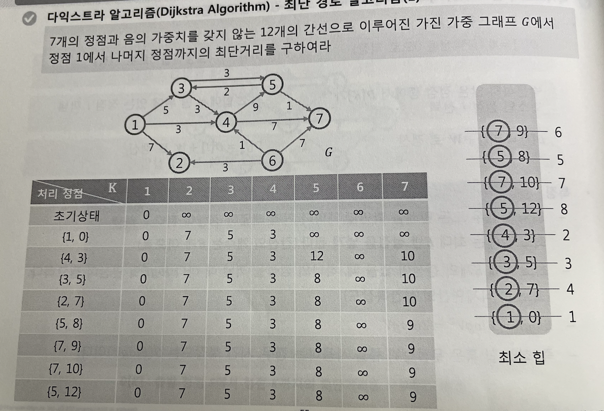

# 다익스트라 파이썬 구현

한 정점에서 >> 모든 정점까지의 최단거리(비용) 계산 가능

- 음의 간선이 없을 때
- 매 상황에서 가장 비용이 적은 노드 선택
- 힙을 사용해야 시간복잡도가 적다
- 원래는 log V^2 인데 Elog V 로 단축 가능

1. 출발점을 설정
2. 최단 거리 테이블 초기화
3. 해당 노드를 거쳐서 다른 노드로 가는 비용 총 계산 후 적은 값 업데이트

## 실제 구현

1. 2차원 배열 만들고
2. 체크배열 만들고
3. 간선의 정보를 받고
4. ㅇㅇ 하면됨

갈수있는 노드는 거리계산 해놓기만하고 방문은 맘대로 ㄴㄴ

## **방문은 가중치 짧은 순서대로 가야댐** 

## **그래야 방문 했을 때 딱 최단경로로 업뎃됨.**

