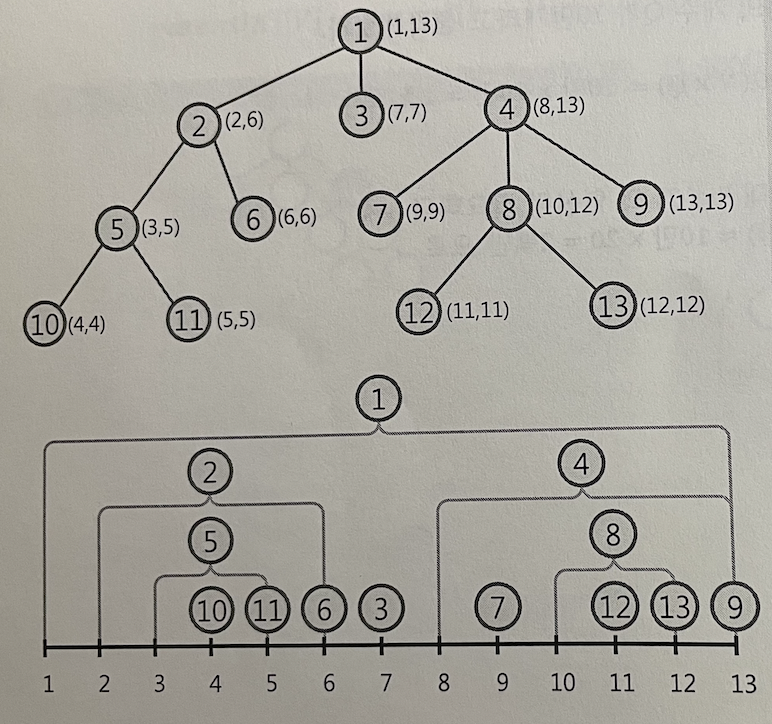

# 트리에서 조상-자손 관계를 판별하는 방법

각 노드의 방문 순서와 탈출순서를 기록한다.

루트노드 부터 dfs를 이용하여 진입 탈출 순서를 저장한다.

## x가 y의 부모인가요?

- in(x) <= in(y) <= out(y) <= out(x)

를 만족하면 x는 y의 부모이다.

왜냐면 생각해바 x를 먼저방문했고, 동시에 탈출은 y보다 나중에함!

즉 순서 : x방문 >>> y방문 >>> y탈출 >>> x탈출

