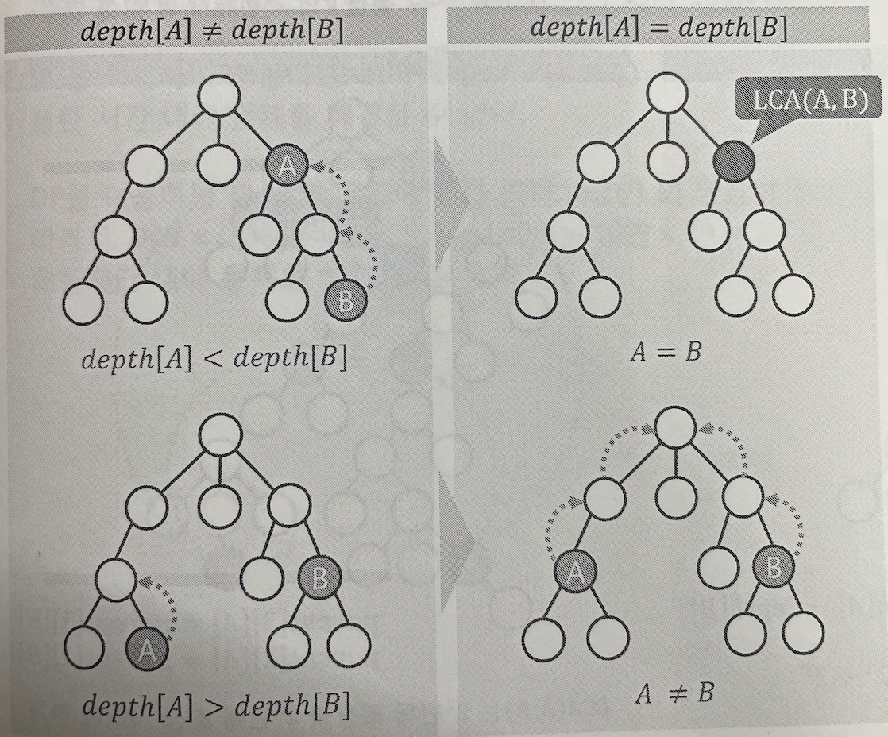
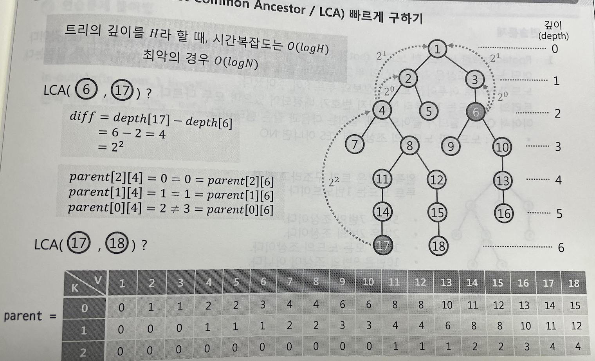

#  파이썬 LCA 최소공통조상

DFS 나 BFS 를 통해서 각 노드의 깊이를 찾기

시간복잡도는 트리의 깊이와 같다. 최악의 경우 O(N)

각 노드에서 하나하나씩 올라가기엔 너무 오래걸린다.

## 2^k승 의 조상들도 체크한다.

이렇게 하면 시간복잡도는 log트리의깊이 최악의 경우 logN

# 알고리즘 구현 방법

1. depth 와 2^k번째 조상을 저장하는 dp를 만든다.

2. 깊이가 더 깊은 노드를 낮은 노드로 맞춰준다.

   > 방법 : 
   >
   > 깊이를 2^k 승 만큼 올려주는데, 위에서부터 내려오다가 깊이가 낮아지면 노드 업데이트. 반복하면서 깊이 같을 때 까지.

3. dp를 만들려면 점화식이 필요해요.

4. 어렵다...

