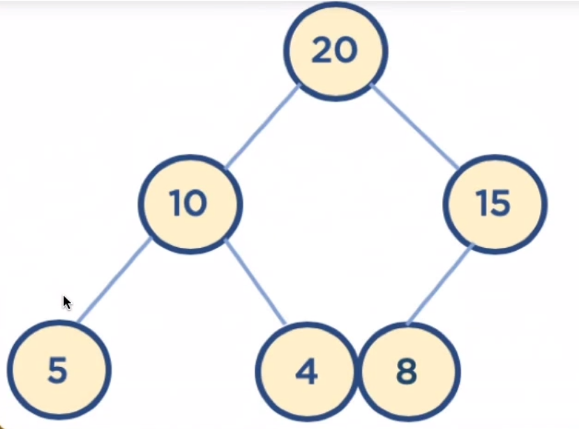
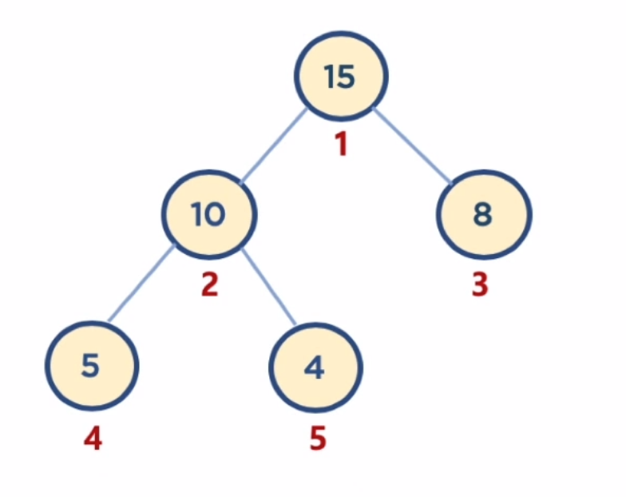

## 힙, 우선순위 큐

### 힙 Heap

- 최대값 최소값을 빠르게 찾을 수 있는 **완전 이진 트리**

  > 완전 이진 트리 : 
  >
  > 노드를 삽입할 때 최하단 노트부터 차례대로 삽입하는 트리

- 왼쪽 오른쪽 자식 노드 간에는 비교할 필요 없다. **부모 자식 간에만 비교**

> 이진 트리 : 각각의 노드가 최대 두 개의 자식 노드
>
> #### **이진 탐색 트리** : 왼쪽 자식 노드값이 가장 작고, 그 다음 부모, 그 다음 오른쪽 자식
>
> 탐색을 위한 구조이다.
>
> 
>

### 힙 구조의 예시 사진 (최대 힙)

 

### 힙에 데이터 삽입

- 삽입된 데이터는 왼쪽 하단 부터 채워짐
- 부모 노드와 값을 비교 후, 부모 노드와 위치를 스왑한다.
- 힙 조건을 만족할 때 까지 반복

### 힙의 데이터 삭제 (최대값 or 최소값만을 꺼냄)

- 가장 마지막에 삽입한 노드를 루트 노드와 스왑 후 데이터를 꺼낸다.
- 자식 노드와 비교, 둘 중 큰 자식과 스왑한다.

### 힙의 구현

- 힙은 배열 자료구조 사용
- 힙 구현의 편의성을 위해 **루트 노드 인덱스를 1로 지정**
- 부모 인덱스 = 자식 // 2
- 왼쪽 자식 = 부모 * 2
- 오른쪽 자식 = (부모 * 2) + 1



### 힙 구현 코드 (최대 힙)

```python
class Heap :
    def __init__(self, data) : # 힙 클래스 객체 생성시 루트 노드를 넣고 생성
        self.heap_array = list()
        self.heap_array.append(None)
        self.heap_array.append(data)

    def move_up(self, inserted_idx) : # 부모 자식 바꿔야 하면 True 리턴하는 함수
        if inserted_idx <= 1 : # 힙에 암것도 안들어 있거나 방금 삽입한게 첫 데이터인 경우
            return False
        
        parent_idx = inserted_idx // 2
        
        if self.heap_array[inserted_idx] > self.heap_array[parent_idx] :
            return True # 부모 자식 비교 후 자식이 더 크면? 바꿔야댐
        else :
            return False
    
    def insert(self, data) : # 힙에 데이터 삽입
        if len(self.heap_array) == 0 : # 힙에 데이터가 없는 경우
            self.heap_array.append(None)
            self.heap_array.append(data) 
            return True

        self.heap_array.append(data) # 일단 왼쪽 하단에 데이터 삽입

        inserted_idx = len(self.heap_array) - 1
        # 삽입된 데이터의 위치

        while self.move_up(inserted_idx) : # 부모 자식 바꿔야 되면 계속 바꿈
            parent_idx = inserted_idx // 2
            self.heap_array[inserted_idx], self.heap_array[parent_idx] = self.heap_array[parent_idx], self.heap_array[inserted_idx]
            # 부모 자식 데이터 스왑        
            inserted_idx = parent_idx
            # 스왑했으니 인덱스 위치 바꾸고 다시 체크

    def move_down(self, popped_idx) :
        l_child_idx = popped_idx * 2
        r_child_idx = (popped_idx * 2) + 1
        
        if len(self.heap_array) - 1 < l_child_idx : # 자식 없는 경우
            return False

        elif len(self.heap_array) - 1 == l_child_idx : # 왼쪽 자식만 있는 경우
            if self.heap_array[l_child_idx] > self.heap_array[popped_idx] :
                # 왼쪽 자식이 부모 보다 크면
                return True
            else :
                return False

        else : # 왼쪽 오른쪽 둘다 자식 있는 경우
            if self.heap_array[l_child_idx] > self.heap_array[r_child_idx] :
                # 왼쪽 자식이 오른쪽 자식보다 크면
                if self.heap_array[l_child_idx] > self.heap_array[popped_idx] :
                # 왼쪽 자식이 부모보다 크면
                    return True
                else :
                    return False
            else :
                if self.heap_array[r_child_idx] > self.heap_array[popped_idx] :
                # 오른쪽 자식이 부모보다 크면
                    return True
                else :
                    return False
            
    def pop(self) :
        if len(self.heap_array) <= 1 :
            return None # 암것도 안들어 있으면 None 리턴

        last_idx = len(self.heap_array) - 1
        self.heap_array[last_idx], self.heap_array[1] = self.heap_array[1], self.heap_array[last_idx]
        # 루트 노트랑 마지막 노드랑 데이터 스왑
        popped_data = self.heap_array.pop() # 마지막 데이터 꺼내기
        popped_idx = 1
        
        while self.move_down(popped_idx) : # 부모 자식 바꿔야 되면 계속 바꿈
            l_child_idx = popped_idx * 2
            r_child_idx = (popped_idx * 2) + 1
            
            if len(self.heap_array) - 1 == l_child_idx : # 왼쪽 자식만 있는 경우
                self.heap_array[l_child_idx], self.heap_array[popped_idx] = self.heap_array[popped_idx], self.heap_array[l_child_idx]
                # 스왑
                popped_idx = l_child_idx
            else :
                if self.heap_array[l_child_idx] > self.heap_array[r_child_idx] :
                # 왼쪽 자식이 오른쪽 자식보다 크면
                    self.heap_array[l_child_idx], self.heap_array[popped_idx] = self.heap_array[popped_idx], self.heap_array[l_child_idx]
                    # 스왑
                    popped_idx = l_child_idx
                else : # 오른쪽 자식이 더 크면 오른쪽 자식과 스왑
                    self.heap_array[r_child_idx], self.heap_array[popped_idx] = self.heap_array[popped_idx], self.heap_array[r_child_idx]
                    popped_idx = r_child_idx

        return popped_data
```

### 힙의 시간 복잡도

- 로그 n (삽입 또는 삭제 시)

