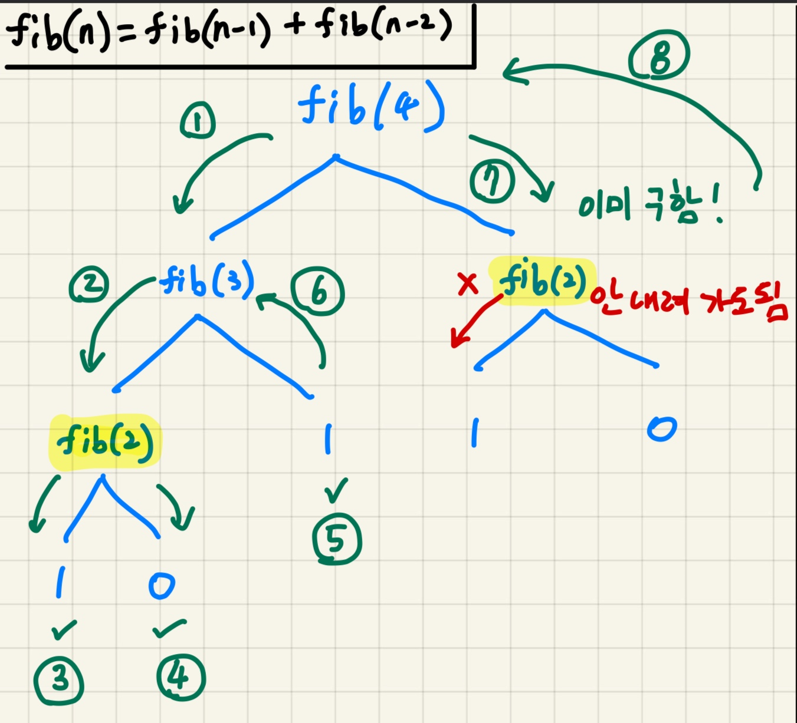
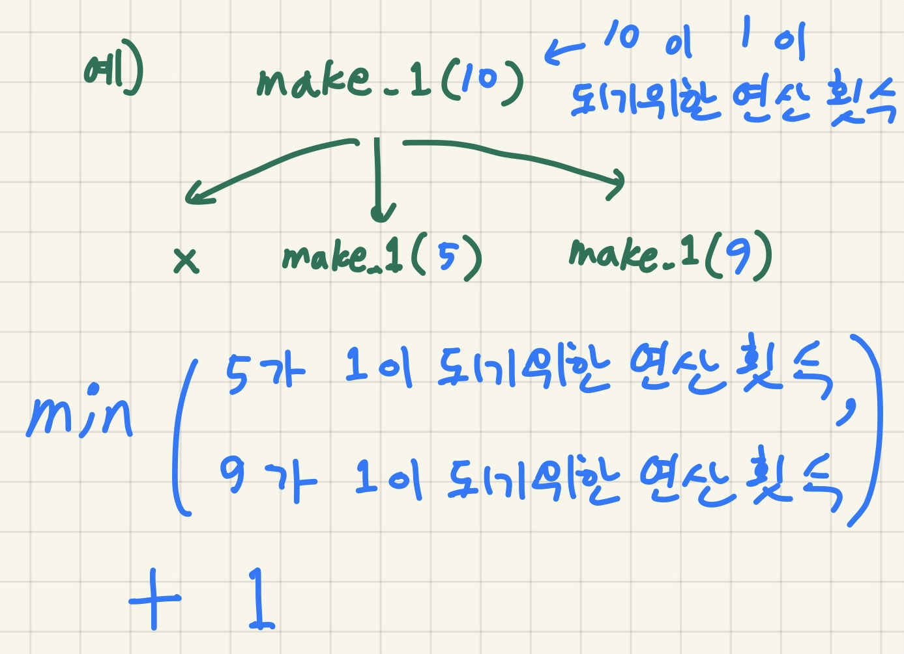

## DP와 메모이제이션 기본

피보나치 수열 함수 구현을 통해 DP와 메모이제이션에 대해 알아보자
피보나치 수열 = 0, 1, 1, 2, 3, 5 ,8, 13, 21, 34, ....

## DP란

- Dynamic Programmig의 약자
- 동적계획법
- 문제를 해결하기 위한 접근 방식 중 하나이다.

## dp의 핵심

1. 재귀적, 귀납적, 분할적으로 문제 해결..
   - 작은 문제는 해결되어 있다고 생각하고 큰 문제를 해결하는 방법!
   - 피보나치 수열을 구하는 방법으로 생각해보면
   - F(n) = F(n-1) + F(n-2)
   - (n >= 2)
   - F(n-1) 와 F(n-2) 가 해결되어 있다고 생각하고 큰 문제를 해결한다!

2. 반복적이고 불필요한 계산을 줄이기
   - **메모이제이션** 이라는 방법을 사용해서 줄이는 방법이 있다.
   - 이미 했던 계산은 따로 저장해둔 뒤, 나중에 다시 쓰는 방법.

---

## 보통 재귀적인 방식을 이용하는 Top-down 방식

- 가장 큰 문제에 들어가서 작은 문제를 재귀적으로 호출하면서 답을 찾는 방식
- 점화식을 이해하기 쉽다.
- **메모이제이션**을 통해 계산을 줄여야한다.

## 파이썬 코드

```python
dp = [0]*10000 # 한 번 계산한 결과는 dp 라는 배열에 저장!
def fib(n) :
    if n == 0 : 
        return 0
    if n == 1 : 
        return 1
    if dp[n] != 0 : 
        return dp[n] # 방문 한 적이 있다면 값 바로 반환
   	else :
        dp[n] = fib(n-1) + fib(n-2)
        return dp[n]
```

## 작동 방식



---

## 밑에서부터 차근차근 계산해가는 Bottom-up 방식

- 가장 기본적인 값을 계산 후 차근차근 특정 값을 계산한다.
- 피보나치로 예를 들면 fib(0) = 0, fib(1) = 1 임을 이용하여 손으로 풀듯이 차례대로 fib(2), fib(3), ... 을 구해간다.
- 보통 반복문을 이용한다.

```python
fib = [0]*10000
fib[0] = 0
fib[1] = 1
for n in range(2,10000) : 
    fib[n] = fib[n-1] + fib[n-2]
```

---

---

## 백준 1463번

https://www.acmicpc.net/problem/1463

```python
정수 X에 사용할 수 있는 연산은 다음과 같이 세 가지 이다.

1. X가 3으로 나누어 떨어지면, 3으로 나눈다.
2. X가 2로 나누어 떨어지면, 2로 나눈다.
3. 1을 뺀다.

정수 N이 주어졌을 때, 위와 같은 연산 세 개를 적절히 사용해서 1을 만들려고 한다. 연산을 사용하는 횟수의 최솟값을 출력하시오.
```

**작은 문제는 해결되어 있다고 생각하고 큰 문제를 해결하는 방법!**

make_1(x) = min(make_1(x//3), make_1(x//2), make_1(x-1)) + 1

이 식만 이해하면 된다!!



```python
import sys
sys.setrecursionlimit(1000000)

X = int(sys.stdin.readline())

dp = [0]*(X+1) # dp[i] : i가 1이 되기 위한 연산의 횟수

def make_1(x) :
    if x == 1 :
        return 0
    if dp[x] != 0 :
        return dp[x]
    else :
        if x%6 == 0 :
            dp[x] = min(make_1(x//3), make_1(x//2), make_1(x-1)) + 1
            return dp[x]
        elif x%3 == 0 and x%2 != 0 :
            dp[x] = min(make_1(x//3), make_1(x-1)) + 1
            return dp[x]
        elif x%3 != 0 and x%2 == 0 :
            dp[x] = min(make_1(x//2), make_1(x-1)) + 1
            return dp[x]
        else :
            dp[x] = make_1(x-1) + 1
            return dp[x]
        

print(make_1(X))
```

근데 재귀 방식(Top-down)으로 푸니 메모리 초과가 난다.

아래는 Bottom-up 풀이이다.

```python
import sys
X = int(sys.stdin.readline())

make_1 = [0]*(10**6 + 1) # make_1[i] : i가 1이 되기 위한 연산의 횟수
make_1[1] = 0
make_1[2] = 1
make_1[3] = 1

for x in range(4, X+1) :
    if x%6 == 0 :
        make_1[x] = min(make_1[x//3], make_1[x//2], make_1[x-1]) + 1
        
    elif x%3 == 0 and x%2 != 0 :
        make_1[x] = min(make_1[x//3], make_1[x-1]) + 1

    elif x%3 != 0 and x%2 == 0 :
        make_1[x] = min(make_1[x//2], make_1[x-1]) + 1
        
    else :
        make_1[x] = make_1[x-1] + 1

print(make_1[X])
```

여기까지 잘 따라왔다면 DP에 대해서 감이 왔을 것이다!!

---

DP문제는 코딩테스트에서 아주 많이 출제가 된다.

메모이제이션을 사용해서 시간을 줄여야 하는 문제가 무조건 하나는 나오는 것 같다.

많이 풀어서 익숙해지자 !

난이도가 있는 문제를 원하면 이 문제를 한번 풀어보도록 하자.

https://www.acmicpc.net/problem/9251

아래는 유튜브 해설이다.

https://www.youtube.com/watch?v=sSno9rV8Rhg

-dnlxo

