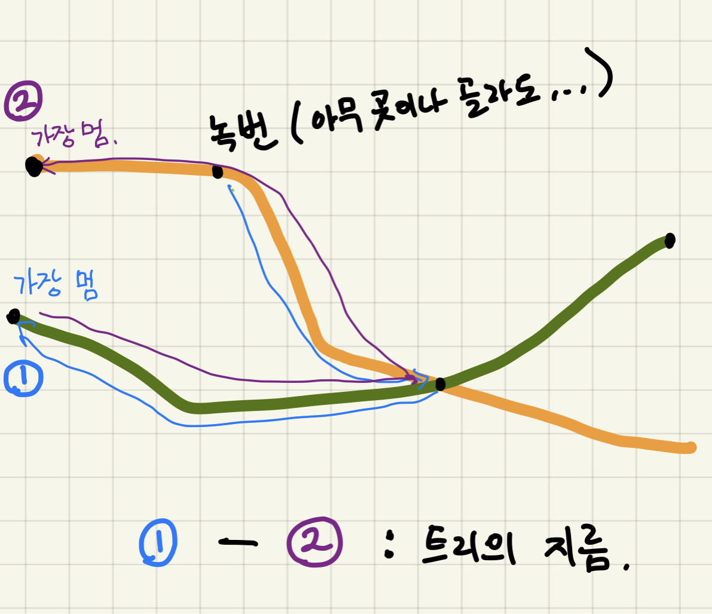

# 트리의 지름 (가장 먼 곳의 가장 먼 곳)

https://www.acmicpc.net/problem/1167

문제의 이해는 쉽지만 어떻게 풀어야 할지.. 방법을 떠올리기 어려웠다. (나만 그런 듯)

지하철을 떠올리면 이해하기 쉽다.

3호선과 7호선만 생각해보자.

그림을 보면 이해가 갈 것이다. 



1. 녹번역(임의의 역)에서 출발하여 가장 먼 역까지 간다.
2. 곧, 녹번역에서부터 가장 거리가 먼 **종점**까지 갔다는 것이다.
3. 그 종점에서 가장 거리가 먼 **또 다른 종점**까지 간다.
4. 두 종점의 거리가 가장 먼 거리가 된다.

---

실제 문제로 돌아와서, 트리의 한 노드에서 가장 거리가 먼 노드까지 도달하는 방법을 생각해보자

DFS혹은 BFS를 이용할 수 있겠다. 뭘 이용하던 완전탐색만 하면 된다.

또는 다익스트라를 이용할 수도 있다.

풀어보자. 첫 출발은 1번 노드다.

---

## 파이썬 코드

```python
# BFS
# input 받는 부분이 난잡할 수 있습니다. 암튼 이중리스트로 받음
import sys
from collections import deque

N = int(sys.stdin.readline())

graph = [[] for n in range(N+1)]
# graph[i] = [node, cost] i에서 node로 가는 비용 : cost

for n in range(N) :
    edges = list(map(int, sys.stdin.readline().split()))
    edges_ = edges[1:-1]
    for i in range(len(edges_)) :
        if i % 2 == 0 :
            graph[edges[0]].append((edges_[i], edges_[i+1]))

def bfs(start) : # start 부터 가장 먼 노드와 거기까지의 거리를 매번 갱신하면서 돌기
    check = [False]*(N+1)
    far_node, far_dist = 0, 0
    need_visit = deque([])
    need_visit.append((start, 0))
    while need_visit :
        n, c = need_visit.popleft()
        check[n] = True
        for node_cost in graph[n] :
            node, cost = node_cost
            if not check[node] :
                need_visit.append((node, cost + c))
              
                if far_dist < cost + c :
                    far_node, far_dist = node, cost + c

    return far_node, far_dist

fn, fd = bfs(1)

ffn, ffd = bfs(fn)

print(ffd)
```

```python
# DFS (재귀방식)
# 원리는 비슷합니다.
import sys
sys.setrecursionlimit(1000000)

N = int(sys.stdin.readline())

graph = [[] for n in range(N+1)]
# graph[i] = [node, cost] i에서 node로 가는 비용 : cost

for n in range(N) :
    edges = list(map(int, sys.stdin.readline().split()))
    edges_ = edges[1:-1]
    for i in range(len(edges_)) :
        if i % 2 == 0 :
            graph[edges[0]].append((edges_[i], edges_[i+1]))

check = [False]*(N+1)

far_node, far_dist = 0, 0

def dfs(start, dist) :
    global far_node
    global far_dist
    check[start] = True
    for node_cost in graph[start] :
        node, cost = node_cost
        if not check[node] :
            dfs(node, dist + cost)
    if dist > far_dist :
        far_node, far_dist = start, dist

dfs(1, 0)
fn = far_node

check = [False]*(N+1)
far_node, far_dist = 0, 0
dfs(fn, 0)
print(far_dist)
```

```python
# 다익스트라
# 다익스트라는 보통 최단거리 계산시 사용하지만, 어차피 table에 최장거리 노드도 표시된다.
import sys
import heapq

N = int(sys.stdin.readline())

graph = [[] for n in range(N+1)]
# graph[i] = [node, cost] i에서 node로 가는 비용 : cost

for n in range(N) :
    edges = list(map(int, sys.stdin.readline().split()))
    edges_ = edges[1:-1]
    for i in range(len(edges_)) :
        if i % 2 == 0 :
            graph[edges[0]].append((edges_[i], edges_[i+1]))
            
INF = 9999999

def ds(start) :
    check = [False]*(N+1)
    heap = []
    heapq.heappush(heap, (0, start)) # (비용, 노드) 순서로 푸쉬

    table = [INF]*(N+1) # start 에서 table[i] 까지 거리
    table[start] = 0

    while heap :
        c, n = heapq.heappop(heap)
        if check[n] == True :
            continue
        
        for node_cost in graph[n] :
            node, cost = node_cost
            if c + cost < table[node] :
                table[node] = c + cost
                heapq.heappush(heap, (c + cost, node))   
        check[n] = True

    far_dist = 0
    far_node = 0
    for n in range(N+1) :
        if table[n] == INF :
            continue
        else :
            if far_dist < table[n] :
                far_node = n
                far_dist = table[n]
    return far_node, far_dist

fn, fd = ds(1)

print(ds(fn)[1])
```


---

한 문제로 여러가지 복습을 해서 좋았다 ㅎㅎ. 오래걸렸지만 ㅠㅠ

의외로 속도는 dfs가 제일 빨랐다.

세 가지 모두 자연스럽게 이용 가능하도록 노력해보자.

-dnlxo