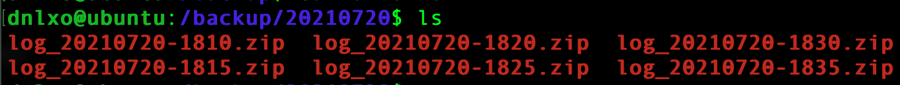
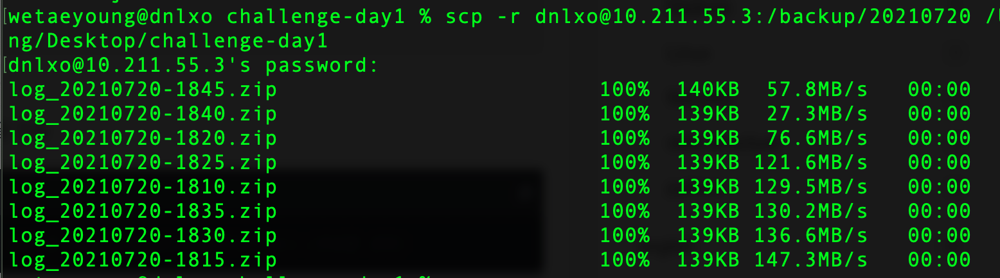

## 쉘 스크립트 자동화

---

### 쉘 스크립트 작성

1. 

   ```bash
   $ cd /backup
   $ mkdir 20210720
   $ ls
   ```

   위 명령어로 하위 디렉토리를 생성 후 확인해본다.

2. 

   ```bash
   $ vi day02.sh
   ```

   위 명령어로 파일을 생성한 뒤 내용을 작성한다.

   ```bash
   #!/bin/bash
   
   zip (저장할 지렉토리)/(생성되는 압축파일 이름).zip (압축할 파일들...)
   ```

   해당 파일을 실행할 때 OS는 "#!" 을 보고 이 아래 작성된 코드들이 "/bin/bash" 라는 프로그램을 통해서 해석된다고 알게된다.

   ```bash
   $(date +'%Y%m%d-%H%M')
   ```

   파일명 중간에 위와 같은 형식으로 입력해주면 생성 시간이 들어간다.

   **최종 스크립트 파일**

   ```bash
   #!/bin/bash
   
   zip /backup/20210720/log_$(date '+%Y%m%d-%H%M').zip /var/log/syslog /var/log/dmesg
   ```

3. 

   ```bash
   $ sh day02.sh
   $ cd 20210720
   $ ls
   ```

   ":wq" 를 입력하여 파일을 저장하고 닫은 뒤, 위 명령어를 이용하여 스크립트 파일을 실행한다.

   압축파일이 저장된 폴더로 이동한 뒤 압축파일이 잘 생성되었나 확인해본다.

   

---

### 자동화 설정

1. 

   ```bash
   $ chmod 700 day02.sh
   $ crontab -e
   ```

   스크립트 파일의 권한을 변경하고, 위 명령어를 입력하여 크론탭 설정에 들어간다.

   에디터를 고르고 (필자는 2번 선택) 크론탭 파일 내부에 작업을 작성한다!

   ```bash
   */5 * * * * /backup/day02.sh
   ```

   위처럼 매 5분마다 실행되도록 설정한다.

   ```bash
   $ service cron start
   ```

   작업 후에는 항상 cron 을 실행(재가동)시킨다.

   

   백업이 잘 되고있는지 확인한다.

2. 

   ```bash
   $ vi copy.sh
   $ chmod 700 copy.sh
   $ cd /var
   $ sudo chwon dnlxo log
   ```

   /var 로 이동하여 log의 소유자를 나로 바꾼다.

   ```bash
   #!/bin/bash
   
   if [ -e /var/log/syslog_1 ]; then
           sudo rm /var/log/syslog_1
   fi
   sudo cp /var/log/syslog /var/log/syslog_1
   ```

   파일의 복사와 삭제를 위해 스크립트 파일을 작성한다.

3. 

   ```
   29,59 * * * * /backup/copy.sh
   ```

   위와 같이 크론탭 설정을 추가한다. 매 시각 29분, 59분마다 실행된다.

---

### 백업파일을 원격에서 로컬로 보내기

```bash
$ scp -r dnlxo@10.211.55.3:/backup/20210720 /Users/wetaeyoung/Desktop/challenge-day1
```

**로컬에서!!** 위 명령어를 입력한다.



파일들이 받아진 것을 확인한다.

---

### 출처

- https://zzangjava.tistory.com/303
- https://hyunsuk2.github.io/2018/01/16/ssh/
- https://osh88itopia.tistory.com/8
- https://jdm.kr/blog/2

