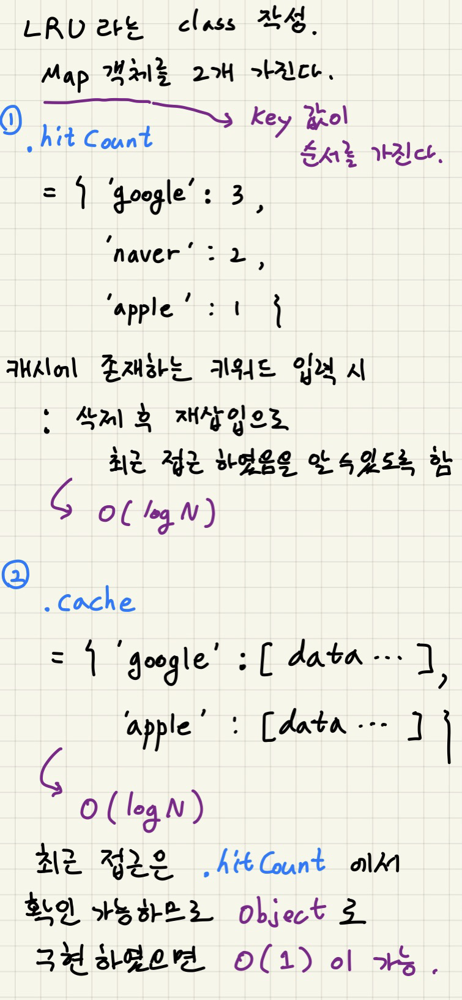

## ⚡️ Cache

---

### 캐시

- 사전적 의미 : 나중에 필요할 수도 있는 무언가를 저장하였다가 신속하게 회수할 수 있는 보관장소로 어떤 식으로든 보호되거나 숨겨진다.
- 캐시라는 개념은 웹 뿐만 아니라 컴퓨터의 메모리 부분 등 다양한 곳에서 쓰인다.
- 공통적으로 가져오는데에 비용이 드는 **데이터를 한 번 가져온 뒤에는 임시로 저장해두는 것**을 의미한다.
- 웹 캐시는 이미지 등 정보를 불러올 때 데이터 사용량도 발생하고, 시간도 들기 때문에 사용자가 여러번 방문할 것 같은 사이트에서는 한 번 받아온 데이터를 사용자의 컴퓨터나 중간 역할을 하는 서버에 저장해 두는 것이다.

---

### 캐시의 작동 방식

- 원본 데이터와는 별개로 자주 쓰이는 데이터(Hot Data)들을 복사해둘 캐시 공간을 마련한다.
- 캐시 공간은 O(1) 처럼 낮은 시간복잡도로 접근 가능한 곳을 주로 사용한다. (해시 테이블처럼!)
- 데이터 요청이 들어오면, 원본 데이터가 담긴 곳에 접근하기전에 먼저 캐시 내부를 찾는다.
- 캐시에 찾는 데이터가 없거나(Cache miss) 너무 오래되어 최신성을 잃었으면(Expiration, 프로그래머가 직접 로직 생각하는 부분) 원본 데이터가 있는 곳에 접근하여 데이터를 가져온다.
- 이 때 원본 데이터를 가져오면서 캐시에 해당 데이터를 복사하거나 갱신한다.
- 캐시에 찾는 데이터가 있으면(Cache hit) 캐시에서 바로 해당 데이터를 제공한다.
- 캐시 공간은 작게 사용하므로, 공간이 모자라면 안 쓰는 데이터부터 삭제하여 공간을 확보한다. (Eviction)

---

### 웹 캐시

- 네트워크를 통해 데이터를 가져오는 것은 하드디스크보다 느릴 때가 많다.
- 그래서 웹 브라우저는 웹 페이지에 접속할 때 HTML, CSS, JS, 이미지 등을 하드디스크나 메모리에 캐싱해 두었다가 다음번에 다시 접속할 때 재활용한다. (브라우저 캐시)
- 웹 서버 또한 상당수의 경우 동적 웹 페이지라고 할지라도 매번 내용이 바뀌지 않는 경우가 많아서, 서버에서 생성한 HTML을 캐싱해 두었다가 다음번 요청에 재활용한다. (응답 캐시)
- 이와 유사하게 클라이언트로부터 자주 요청받는 내용은 웹 서버로 전달하지 않고 웹 서버 앞단의 프록시 서버에서 캐싱해둔 데이터를 바로 제공하기도 한다. (프록시 캐시)

---

### 브라우저 캐시

- 캐시 정책은 해당 웹 페이지의 전반적인 상황에 따라 각 파일마다 다르게 적용되어야 한다.
- 적어도 정적 파일과 동적인 부분의 브라우저 캐싱 정책은 달라야 한다.
- 비공개 정보가 담긴 페이지는 보안상 캐싱을 막아야 할 수도 있다.

---

### LRU 캐시를 직접 구현해보자 O(1)

- https://leetcode.com/problems/lru-cache/
- Least Recently Used
- 가장 오랫동안 참조되지 않은 것을 교체하는 기법
- O(1) 로 구현은 그렇게 간단하지 않다.
- 구현 방법
  - 새로운 데이터가 들어온 경우
    - 캐시에 넣어준다.
    - 캐시가 가득차있다면, 가장 오랫동안 참조되지 않은 데이터를 제거하고 넣어준다.
  - 존재하는 데이터가 들어온 경우
    - 해당 데이터를 꺼낸다.
    - 가장 최근 데이터 위치로 보내준다.
  - get(key) : get the value of the key if the key exists in the cache, otherwise return -1.
  - put(key, value) : Set or insert the value if the key is not already present. When the cache reached its capacity, it should invalidate the least recently used item before inserting a new item.
  - Doubly Linked List 개념이 들어간다. (노드의 양방향 연결)
    - 노드 추가
      - 이전 <--> 다음 
      - 위와 같은 형태로 연결 되어있었다고 하자.
      - 새로운 노드 -> 다음 연결
      - 새로운 노드 <- 다음 연결
      - 이전 -> 새로운 노드 연결
      - 이전 <- 새로운 노드 연결
      - 이전 <--> 새로운 노드 <--> 다음
      - 완성!
  - O(1)의 탐색을 위해 Hash Map 도 사용한다.

```java
class LRUCache {
    //(2,2) - (4,4) - (3,3)
    
    public class CacheItem {
        int key;
        int value;
        CacheItem prev;
        CacheItem next; // 더블리 링크드 리스트
        public CacheItem(int key, int value) {
        this.key = key;
        this.value = value;
        }
    }
    
    CacheItem head;
    CacheItem tail;
    int capacity;
    Map<Integer, CacheItem> map;
    
    public LRUCache(int capacity) {
        head = null;
        tail = null;
        this.capacity = capacity;
        map = new HashMap<>();
    }
    
    public int get(int key) {
        if (!map.containsKey(key)) {
        return -1;
        } else {
            CacheItem cur = map.get(key); // map 에는 { key : (key, value) } 저장
            
            if (cur != head) {
                if (cur == tail) {
                    // 꼬리를 헤드로 이동시키니까 꼬리를 바꿔줌
                    tail = tail.prev;
                }
                
                if (cur.prev != null) cur.prev.next = cur.next;
                if (cur.next != null) cur.next.prev = cur.prev;
                cur.next = head;
                head.prev = cur;
                cur.prev = null;
                head = cur; // 현재 노드에서 원래 연결 다 끊고 헤드로 옮기기 성공!
            }
            return cur.value;
        }
    }
    
    public void put(int key, int value) {
        if (get(key) == -1) { // 새로운 넘이 들어옴!
            CacheItem cur = new CacheItem(key, value);

            if(head == null) {
                head = cur;
                tail = cur;
            } else {
                cur.next = head;
                head.prev = cur;
                head = cur;
            } // 새로운 놈 추가 완료

            map.put(key, cur);

            if (map.size() > capacity) {
                map.remove(tail.key);
                tail.prev.next = null;
                tail = tail.prev;
            } // 넘치면 꼬리 자르기
        } else {
            map.get(key).value = value;
        } // 있는 놈이 들오면 밸류만 업뎃. get(key)를 하니까 자동으로 head로 감
    }
}
```

---

### 오늘 구현한 나의 캐시...



---

### 출처

- https://www.youtube.com/watch?v=OpoVuwxGRDI
- https://www.youtube.com/watch?v=c33ojJ7kE7M
- https://www.youtube.com/watch?v=WOaQfWqlV7A
- https://opentutorials.org/module/1335/8940