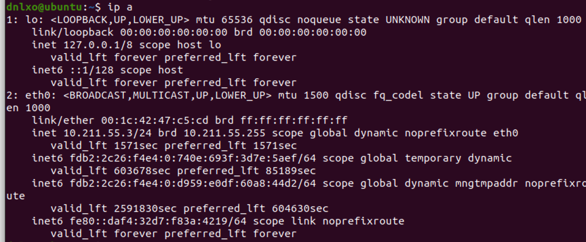
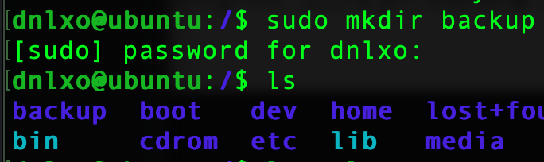
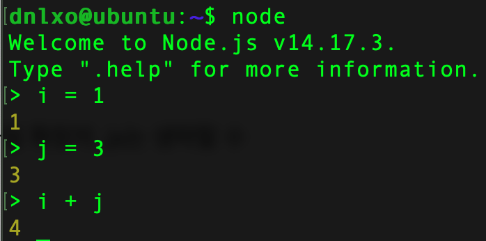
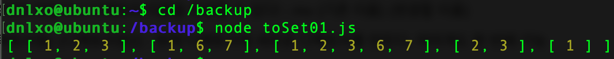

## 리눅스 설치

---

### Parallels를 사용하여 리눅스를 설치해보자 (M1 맥)

1. https://www.parallels.com/products/desktop/ 에 접속하여 다운받는다.
2. https://cdimage.ubuntu.com/focal/daily-live/current/ 에 접속하여 "64-bit ARM (ARMv8/AArch64) desktop image" 를 다운받는다.
3. 설치완료 후 재부팅을 진행한다.

---

### ssh 설정을 해보자

1. 

   ```bash
   $ sudo apt update
   $ sudo apt install openssh-server
   ```

   위 명령어로 open ssh server를 설치한다.

2. 

   ```bash
   $ sudo systemctl status ssh
   
   $ sudo systemctl enable ssh
   $ sudo systemctl start ssh
   ```

   위 명령어로 ssh가 실행중 인지 확인한다.

   실행 중이 아니라면 아래 두 명령어로 실행한다.

   

   active (running) 으로 실행 중인 것을 확인할 수 있다.

3. 

   ```bash
   $ sudo ufw status
   $ sudo ufw allow ssh
   ```

   방화벽을 사용중인지 확인하고, 사용중이라면 ssh를 허용하도록 한다.

4. 

   ```bash
   $ ip a
   ```

   ubuntu에서 위 명령어로 ip를 확인한다. (10.211.55.3)

   

5. 

   ```bash
   $ ssh dnlxo@10.211.55.3
   ```

   맥에서 터미널을 켜고 우분투 설치 시 입력한 계정이름과 패스워드로 접속한다.

   

   접속이 완료 되었다!!!!

6. 

   ```bash
   $ sudo systemctl stop ssh
   ```

   위 명령어로 ssh를 멈출 수 있다.

---

### 사용자 생성을 해보자

1. 

   ```bash
   $ sudo adduser dnlxo
   $ su dnlxo
   $ cd
   $ pwd
   ```

   위 명령어를 입력하고 비밀번호와 기타 정보를 입력한다. 기타 정보는 입력하지 않아도 된다.

   홈 디렉토리도 알아서 생성해준다.

   "su" 명령어로 로그인 한 뒤 "cd"와 "pwd"를 입력해보면 새로운 계정의 홈 디렉토리가 생성된 것을 알 수 있다.

---

### 디렉토리 생성과 접근 권한 설정

1. ```bash
   $ ls
   $ ls -al
   $ pwd
   ```

   위 명령어로 현재 작업중인 위치와 디렉토리 및 파일들을 살펴보자

   

2. 

   ```bash
   $ cd /
   $ sudo mkdir backup
   $ ls
   ```

   위 명령어를 통해 backup 이라는 디렉토리를 생성하고 잘 생성되었는지 확인한다.

   

3. 

   ```bash
   $ sudo chmod 764 backup
   $ ls -al
   $ sudo chown dnlxo backup
   $ ls -al
   ```

   위 명령어로 backup 디렉토리에 764 권한을 부여하고 권한이 제대로 부여되었는지 확인한다.

   소유자를 확인한다.

   

   backup 디렉토리의 소유자를 내 계정으로 변경한 뒤, 소유자를 다시 확인해본다.

   

---

### 가상 환경 시간대 설정하기

1. 

   ```bash
   $ date
   $ timedatectl
   ```

   위 명령어로 현재 시간 정보를 확인해본다. 비교를 위해 일본표준시로 설정하여 JST 로 표기된다.

   

2. 

   ```bash
   $ timedatectl list-timezones
   ```

   위 명령어로 타임존을 확인할 수 있다. 하지만 너무 많다 ㅎㅎ 당황하지말고 : q 를 입력하여 탈출한다.

   ```bash
   $ timedatectl list-timezones | grep Asia
   ```

   Asia 의 타임존만 확인해본다. 확인해보면 Asia/Seoul 이 보인다.

3. 

   ```bash
   $ sudo timedatectl set-timezone Asia/Seoul
   $ date
   $ timedatectl
   ```

   위 명령어로 시간 변경 후 확인까지 해본다.

   

   혹시 모르니 로컬 환경의 시간도 확인해준다.

   

---

### 가상 환경에 node.js 설치하고 로컬-원격 간 파일 전송하기

1. 

   ```bash
   $ sudo apt-get install -y curl
   $ sudo apt update
   ```

   위 명령어로 CURL을 설치하고 업데이트 해준다.

2. 

   ```bash
   $ curl -o- https://raw.githubusercontent.com/creationix/nvm/v0.33.11/install.sh | bash
   $ source ~/.bashrc
   ```

   위 명령어로 NVM을 설치한다.

3. 

   ```bash
   $ nvm list-remote
   $ nvm install v14.17.3
   $ nvm current
   $ nvm use v14.17.3
   ```

   위 명령어를 사용하여 설치할 수 있는 버전들을 확인한 뒤 설치해준다.

   버전이 여러개 깔려있을 경우 버전을 변경할 수도 있다.

4. 

   ```bash
   $ npm install -g npm@latest
   $ npm -v
   ```

   npm을 최신 버전으로 업데이트 해준 뒤 버전을 확인해본다.

   npm은 Node.js에 포함되어있지만 보다 자주 업데이트 된다.

5. 

   ```bash
   $ node
   $ node (파일명)
   ```

   위 명령어로 js코드를 실행할 수 있다. ".exit" 입력시 나가진다.

   

6. 

   ```bash
   $ scp /Users/wetaeyoung/Desktop/challenge-day1/toSet01.js dnlxo@10.211.55.3:/backup/
   
   양식은 $ scp (로컬 파일 위치/파일명) (계정이름@ip):(원격에서 파일을 받을 주소)
   ```

   원격환경이 아니고 **로컬에서!!!** 위 명령어를 입력하여 로컬에서 원격으로 파일을 전송한다.

   ```bash
   $ node toSed01.js
   ```

   위 명령어로 자바스크립트 파일을 실행 할 수 있다. 확장자는 생략 가능하다.

   

---

### 출처

- https://codechacha.com/ko/ubuntu-install-openssh/	
- https://psychoria.tistory.com/750
- https://velog.io/@ywoosang/Node.js-%EC%84%A4%EC%B9%98
- https://iamfreeman.tistory.com/entry/vi-vim-%ED%8E%B8%EC%A7%91%EA%B8%B0-%EB%AA%85%EB%A0%B9%EC%96%B4-%EC%A0%95%EB%A6%AC-%EB%8B%A8%EC%B6%95%ED%82%A4-%EB%AA%A8%EC%9D%8C-%EB%AA%A9%EB%A1%9D